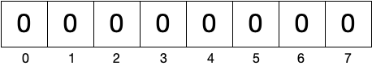

**Vetores** consistem na forma mais elementar de lidar com conjuntos de dados. Um vetor consiste numa sequência de elementos de determinado tipo. O **comprimento** do vetor corresponde ao número de elementos. Os elementos são acedidos mediante **índices**, tendo o primeiro elemento índice zero o últime comprimento menos um. No exemplo seguinte, temos um vetor com comprimento 5, sendo os índices válidos {0, 1, 2, 3, 4}. Nesta secção ilustraremos o conceito de vetor com vetores de números inteiros.

# Alocação e inicialização

<kotlin data-target-platform="js" folded-button="false" data-js-libs="../mylib.js">
external fun alert(s:String)
external fun prompt(s:String,d:String): String

//sampleStart
fun test(n: Int) = 1
//sampleEnd

fun main() {
  //val i = js("myFunction(2,4)")
  val n:String = prompt("?","0")
  alert(test(n.toInt()).toString())
}
</kotlin>
## Inicialização por omissão

<code>
val zeroArray = IntArray(7)
</code>

## Inicialização com função para gerar elementos



## Inicialização com elementos



## Comprimento
O comprimento de um vetor é fixo. Uma vez alocado um vetor, já não é possível alterar o seu comprimento.

O comprimento pode ser zero, isto é, um vetor vazio sem elementos. Esta possibilidade é útil para representar conjuntos de dados vazios. Por exemplo, a interceção de {1, 2} com {3, 4} corresponde ao conjunto vazio. Uma pesquisa para a qual não foram encontrados resultados, também consiste num conjunto vazio.



<code>
val a = IntArray(0)
val aSize = a.size
val b = intArrayOf(2, 4, 6, 8)
val bSize = b.size
</code>

# Acesso por índices

<code>
val even = intArrayOf(2, 4, 6, 8)
val first = even[0]
val last = even[]
</code>

*lastIndex* = *size -1*

# Funções sobre vetores

<code>
tailrec fun sum(a: IntArray, fromIndex: Int = 0, gatherer: Int = 0): Int =
    if (fromIndex > a.lastIndex) gatherer
    else sum(a, fromIndex + 1, gatherer + a[fromIndex])
</code>

<code>
tailrec fun isOrdered(a: IntArray, fromIndex: Int = 0) : Boolean =
    if(fromIndex + 1 > a.lastIndex) true
    else if(a[fromIndex] > a[fromIndex + 1]) false
    else isOrdered(a, fromIndex + 1)
</code>

<code>
tailrec fun findIndex(a: IntArray, n: Int, fromIndex: Int = 0) : Int =
    if(fromIndex > a.lastIndex) -1
    else if(a[fromIndex] == n) fromIndex
    else findIndex(a, n, fromIndex+1)
fun contains(a: IntArray, n: Int) : Boolean = findIndex(a, n) != -1
</code>

# Funções que produzem vetores
<kotlin>
fun invert(a: IntArray) : IntArray =
    IntArray(a.size) { i -> a[a.lastIndex-i]}
</kotlin>

<code>
fun shiftRight(a: IntArray) : IntArray =
    IntArray(a.size) { if (it == 0) a[a.lastIndex] else a[it - 1] }
</code>

<code>
fun subArray(a: IntArray, from: Int, to: Int) = IntArray(to - from + 1) { a[it + from] }
</code>

# Sumário
Vetores consistem numa estrutura de dados elementar que não é frequentemente utilizada diretamente em sistemas complexos, devido essencialmente a não ser prático. O normal é utilizar *listas*, um tema abordado mais À FRENTE, ou outras estruturas. Porém, é importante dominar a manipulação de vetores para efeitos de implementação de algoritmos ou em situações que requerem uma optimização de desempenho.
