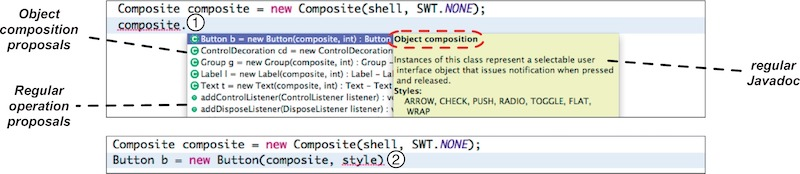

> A large proportion of software developers' time is spent on reading and understanding existing code artifacts (such as APIs). I've contributed to a website that gathers research papers concerning API usability (<http://apiusability.org>{:target="_blank"}).
>
> I've worked in approaches related to API learning, both in the perspective of enriching APIs themselves as well as building up API usage support from existing code (machine learning).

*Click on the icon <i class="fa fa-book"></i> to see related publications.*

***

## Dacite
A technique to annotate APIs with design decisions (mostly pertaining to design patterns), in order to facilitate API discoverability and learning with enhanced IDE code completion.

Dacite stands for *Design Annotations for Complementing Interfaces Targeting Effectiveness*. In collaboration with the [Natural Programming Project](https://www.cs.cmu.edu/~NatProg/dacite.html){:target="_blank"} (CMU).

 

 

***

## APISTA
A technique to learn API sentences from existing code bases (using Markov models), in order to provide code completion in terms of the possible next instructions to write.

 APISTA stands for *API Sentence Token Assistance*, whereas in Portuguese “a pista” means *"the clue"*.

 
