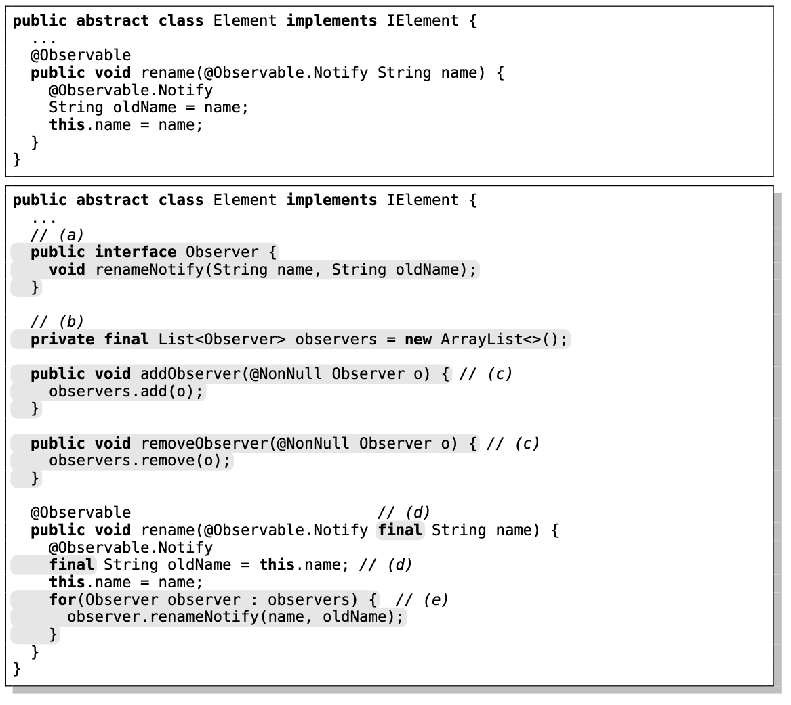

> Software development may suffer from considerable accidental complexity caused by the adopted technology. DSLs are a form of reducing such a complexity, moving the focus to the essential complexity of software. DSLs may also facilitate non-programmers to take part in the development of systems.
>
> My [PhD thesis](docs/AndreLSantosPhD.pdf){:target="_blank"} addressed the development of APIs for Object-Oriented Frameworks that allow instantiation code to closely resemble domain concepts, and in turn, facilitate the definition of a DSL for developing applications based on a given framework.



***



A technique to enrich a framework with a layer of *specialization aspects* -- entities that form a uniform interface for fine-grained instantiation. This layer models the concepts of an application based on the framework, and hence, it embodies the abstract syntax of a modeling language for the framework domain. I've proposed Aspect-Oriented Programming for implementing the specialization layer, demonstrating how to achieve it for Java frameworks with [AspectJ](https://www.eclipse.org/aspectj/).

The ALFAMA workbench is a prototype that automatizes the definition of the abstract syntax of a modeling language in [EMF](https://www.eclipse.org/modeling/emf/){:target="_blank"} from the specialization layer.

{: style="width: 700px; margin-right: 2em;"}

***



Java language extensions (via annotations) for design pattern instantiation, built as [Lombok](https://projectlombok.org) plugins.

This work was developed in the MSc thesis of [Duarte Coelho](https://www.linkedin.com/in/duarte-coelho-224667ba).

{: style="width: 600px; margin-right: 2em;"}

***



A technical DSL to define graphical DSLs in the ecosystem of Eclipse ([EMF](https://www.eclipse.org/modeling/emf/){:target="_blank"}).

<iframe width="420" height="315" src="https://www.youtube.com/embed/7S9qzrLoY2c" frameborder="0" allowfullscreen></iframe>
