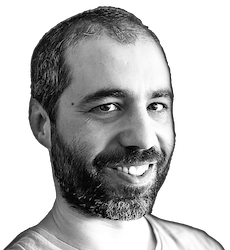

{: style="float: left; margin-right: 2em;"}

## André L. Santos
### [Assistant Professor](https://ciencia.iscte-iul.pt/authors/andre-leal-santos/cv), [Iscte (Instituto Universitário de Lisboa)](http://www.iscte-iul.pt)

#### [Teaching activity](teaching)
 
 
 

***

- PhD (2009) [University of Lisbon](https://www.ulisboa.pt/en) in cooperation with [Tampere University of Technology](https://www.tuni.fi/en), advised by [Kai Koskimies](https://dblp.org/pid/60/3159.html) and [Antónia Lopes](https://www.di.fc.ul.pt/~mal/)

- Visiting researcher at [Carnegie Mellon University](https://www.cmu.edu) (2014), hosted by [Brad Myers](https://www.cs.cmu.edu/~bam/)

- Visiting researcher at [Aalto University](https://www.aalto.fi/en), [LeTech - Learning + Technology](https://research.cs.aalto.fi/LeTech/) (2020), hosted by [Lauri Malmi](http://www.cs.hut.fi/~lma)

***
#### PhD students
- [Afonso Caniço](https://www.linkedin.com/in/afonso-canico/)
- [Ricardo Miranda](https://www.linkedin.com/in/ricardocmiranda/)
- [Daniel Canoli](https://www.linkedin.com/in/danielcanoli/)

#### [MSc students](supervision)
***

 **Digital book on Kotlin:**  [Programação Multiparadigma em Kotlin](kotlin)  (*Português*)

***

## Research
In broad terms, my research activity is mostly related to Human Aspects of Software Development, with a focus on program writing and comprehension, both in an educational perspective as well as professional practice (software developers are constantly learning how to deal with unfamiliar artifacts).

- [Complete list of publications](publications)
- [Google Scholar profile](https://scholar.google.com/citations?hl=pt-PT&user=sYMVDNgAAAAJ&view_op=list_works){:target="_blank"}

*The following links lead to sections containing an overview of my research organised by themes.*

#### <i class="fas fa-university fa-lg"></i> [Programming Education](programmingeducation)
#### <i class="fa fa-indent fa-lg"></i> [Projectional Editors](projectional)
#### <i class="fas fa-book fa-lg"></i> [API Usability](apiusability)
#### <i class="fas fa-file-code fa-lg"></i> [Domain-Specific Languages](dsl)
#### <i class="fas fa-code-branch fa-lg"></i> [Software Maintenance and Evolution](evolution)

***

*I've been actively involved in the Computing Education community:*

- I organized [ICPEC'24](http://icpeconf.org/2024).
- I served in the Program Committee of:
    - [ITiCSE (several editions)](https://iticse.acm.org)
    - [Koli Calling (several editions)](https://www.kolicalling.fi)
    - [SPLASH-E'24](https://2024.splashcon.org/track/splash-2024-SPLASH-E)
- I'm a member of the International Committee of the [SIGSCE Technical Symposium](https://sigcse2023.sigcse.org).
- I participated in the Dagstuhl Seminar on [Notional Machines and Programming Language Semantics in Education](http://www.dagstuhl.de/19281){:target="_blank"}.

***

<i class="fas fa-envelope fa-lg"></i> <a href="mailto:andre.santos@iscte-iul.pt">andre.santos@iscte-iul.pt</a>

<i class="fab fa-github fa-lg"></i> <https://github.com/andre-santos-pt>

<i class="fab fa-linkedin fa-lg"></i> <https://www.linkedin.com/in/andré-l-santos-2b7a27ba/>
