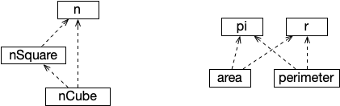
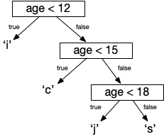

A [secção anterior](expressoescon) abordou a escrita de expressões, apenas utilizando valores concretos. Nesta secção introduzimos expressões **dependentes**, isto é que dependem de valores externos, por sua vez obtidos por via de avaliação de expressões.

Ao entender o conteúdo desta secção, será possível entender a forma como as folhas de cálculo funcionam (para já, sem recurso a fórmulas com funções).

# Sequência de definição de valores
Na secção anterior foi introduzida a definição de valores através de **val**, sendo cada expressão independente. Num programa, podemos definir uma sequência de valores, sendo que as expressões podem referir-se a valores definidos anteriormente. No seguinte exemplo temos a definição do valor *n*, seguida da definição de *nSquare* (*n* ao quadrado).

<kotlin>
val n = 3
val nSquare = n * n
</kotlin>

 As definições serão interpretadas de cima para baixo, e não possível que uma expressão se refira a um valor que ainda não foi definido anteriormente. Logo, a ordem das definições numa sequência não é indiferente.

A **avaliação** de uma sequência consiste em substituir os identificadores de valores numa expressão pelos valores definidos anteriormente. Neste caso, sendo *n* igual a *3*, em *nSquare* *n* será substituído por *3*, e teremos *3 x 3*, ou seja, *9*. Caso fosse acrescentada a definição seguinte, que depende das duas anteriores, *nSquare* seria substituído por *9* e *n* por *3*, resultando em *9 x 3*, ou seja, *27*.

<code>
val n = 3
val nSquare = n * n
val nCube = nSquare * n
</code>

Caso o valor de *n* fosse outro, as outras duas avaliações seriam afetadas.

## Erro  identificador indefinido
No último exemplo, se as definições estivessem na ordem inversa, teríamos um erro. Ao ser interpretada a seguinte sequência, surge um erro, pois no momento da definição de *nSquare* ainda não é conhecido o identificador *n*.



## Exemplo: área e perímetro de circunferência
<code>
val pi = 3.1415926
val r = 4.5
val area = pi * r * r
val perimeter = 2 * pi * r
</code>

## Grafo de dependência de expressões

Os dois últimos exemplos consistem na definição de valores com dependências, ilustradas na seguinte figura (uma seta a tracejado de *a* para *b* denota que *a* depende de *b*). No primeiro caso, as dependências não permitem que as definições dos valores sejam ordenadas de outra forma. Já no segundo caso, existem quatro formas de ordenar as definições.

# Expressões condicionais
Outro tipo de expressão dependente é a **expressão condicional**. Tal como o nome indica, é uma expressão depende de uma condição, por sua vez também uma expressão, para determinar entre duas alternativas qual a expressão que será utilizada na avaliação.

As palavras reservadas para expressões condicionais são **if** e **else**, utilizados em par. No exemplo seguinte, a definição de *nAbs* (módulo de *n*) é feita através de uma expressão condicional. A interpretação é a seguinte: caso *n < 0* (**if**) seja avaliado em verdadeiro (*n* é negativo), então será calculado *-n* (valor simétrico: negativo passa a positivo), caso contrário (**else**) será utilizado o valor do próprio *n*. Sendo *n* igual a *-3*, *nAbs* é avaliado em *-(-3)*, ou seja, *3*.

<code>
val n = -3
val nAbs = if(n < 0) -n else n
</code>

As expressões contidas em **if** terão que ser booleanas, pois os valores de verdadeiro ou falso é que determinarão qual das expressões (esquerda ou direita) será utilizada. A estas condições são normalmente referidas como **guardas**.

## Expressões aninhadas

Como exemplo, suponhamos um programa que tem que manipular escalões etários de uma certa modalidade, sendo esses *infantis* (sub-12), *cadetes* (sub-15), *juniores* (sub-18), e *seniores* (18+). Como forma de codificar o escalão eram utilizas as letras (caracteres) iniciais, ou seja 'i', 'c', 'j', e 's'. Na seguinte definição, *ageGroup* é definido em função de *age*, através de expressões condicionais aninhadas.

<code>
val age = 16
val ageGroup = if(age < 12) 'i' else (if(age < 15) 'c' else (if(age < 18) 'j' else 's'))
</code>

 Sendo *age* igual a *16*, o valor de *ageGroup* seria 'j' (juniores). Em primeiro lugar, *age < 12* é avaliada, resultando em falso, a expressão à direita de **else** é avaliada. Sendo esta também uma condicional, *age < 15* é avaliada também em falso, e o processo prossegue para a última expressão condicional. Neste caso, *age < 18* é avaliada em verdadeiro (*16 < 18*), e logo, o resultado é 'j'.

 De realçar que as guardas dos **if** apenas são avaliadas até ao ponto em que uma é verdadeira. Por exemplo, para uma idade de infantis, por exemplo *11*, o facto da primeira guarda resultar em verdadeiro determina de imediato o resultado da avaliação da expressão.

 Os parênteses que estão incluídos em torno dos sucessivos pares **if-else** não são necessários, e foram escritos neste exemplo para facilitar a compreensão. Expressões aninhadas longas podem não ser fáceis de ler para muitas pessoas. Desta forma, uma forma típica de organizar o código para facilitar a leitura consiste em definir um caso por linha, como no exemplo seguinte.

 <code>
val age = 16
val ageGroup =  if(age < 12) 'i'
                else if(age < 15) 'c'
                else if(age < 18) 'j'
                else 's'
 </code>

## Árvore de decisão binária

A avaliação de uma expressão condicional pode ser analisada em termos de uma árvore de decisão binária, onde perante o resultado de avaliação de uma condição booleana se determina o resultado caso o resultado seja verdadeiro, ou se prossegue para a próxima condição, caso contrário.

# Sumário
Esta secção introduziu sequências de expressões, tendo em conta que existem dependências entre definições, e essas dependências condicionam a ordem pela qual a sequência deve ser definida. Foi também introduzido o conceito de expressão condicional, que determina que expressões com base na avaliação de outras expressões (guardas).

Se formos capazes de dominar bem as expressões, seremos capazes de entender os fundamentos de um dos modelos de programação mais utilizados de sempre, as folhas de cálculo, que são o tema da [próxima secção](folhacalexp).
