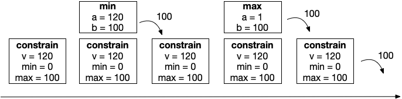

>Na [secção anterior](funcoesind) foram apresentadas funções independentes que dependem apenas da sua própria definição. Nesta secção abordamos **funções dependentes**, ou seja, que se baseiam noutras funções para calcular o seu resultado.

# Funções dependentes

Uma função **dependente**, tal como o nome indica, depende de algo, neste caso de uma ou mais funções. Uma função que não seja muito simples tipicamente depende de outras funções, portanto, uma função ser dependente é um caso frequente.

Por exemplo, poderíamos definir uma função para saber se um número é ímpar, à custa da função para saber se é par. Como demonstrado no exemplo seguinte, isso pode ser feito negando o resultado da invocação de [isEven](funcoesind#isEven), pois ser ímpar é o contrário de ser par.



Considere outro exemplo de função, cujo objetivo é limitar um valor num intervalo *[min, max]*. Se for dado um valor dentro do intervalo é devolvido o próprio valor, caso contrário é devolvido *min* ou *max* dependendo se o valor ultrapassa o intervalo no seu limite inferior ou superior, respetivamente.

{% include code file="constrain.kt"
msg="Exemplo: Função para limitar um valor num intervalo [min, max]. Se for dado um valor dentro do intervalo é devolvido o próprio valor, caso contrário é devolvido <b>min</b> ou <b>max</b> dependendo se o valor ultrapassa o intervalo no seu limite inferior ou superior, respetivamente.
 
constrain(60, 1, 100) &rarr; max(1, <u>min(60, 100)</u>) &rarr; <u>max(1, 60)</u> &rarr; 60
 
constrain(120, 1, 100) &rarr; max(1, <u>min(120, 100)</u>) &rarr; <u>max(1, 100)</u> &rarr; 100
 
constrain(-10, 1, 100) &rarr; max(1, <u>min(-10, 100)</u>) &rarr; <u>max(1, -10)</u> &rarr; 1"
 %}



# Pilha de chamadas

Em computação existe uma forma elementar de organizar dados a que chamamos  **pilha** (*stack*). A metáfora com base no mundo real tem o origem na noção de *pilha de coisas* (e não pilha de energia), onde elementos de algum tipo (p.e. livros, paletes, caixotes) são empilhados em altura. Desta forma, a única forma de manipular a pilha é removendo ou acrescentando elementos no topo (caso contrário a pilha desmorona-se).

Suponhamos que temos três caixotes (*A*, *B*, *C*) e vamos organizá-los numa pilha. Colocamos *A* na base, depois *B* em cima, e por fim *C*. Nesta altura, para chegar a *B* teremos que remover *C* do topo.

Esta é a metáfora de pilha que é utilizada em software, e veremos por agora como é aplicada no encadeamento de invocação de funções.

A **pilha de chamadas** (*call stack*) é a estrutura de armazenamento de valores que é utilizada durante a execução de um programa. Quando uma função executa é colocado um pedaço de memória na pilha de chamadas. A quantidade de memória está relacionada com o número e tipo dos valores que a função manipula. Ao ser invocada outra função, é reservado outro espaço no topo da pilha tendo em conta a memória necessária para a mesma, e assim sucessivamente. Quando uma função retorna, o seu espaço no topo da pilha é libertado, e a função que a invocou prossegue.

Com base no exemplo apresentado anteriormente, ilustramos o funcionamento da pilha de chamadas para a avaliação de *constrain(120, 0, 100)*.

Iremos utilizar o termo **profundidade** para nos referirmos ao número de blocos que estão na pilha de chamadas. Desta forma, o exemplo anterior requer profundidade 3.

## Stack overflow

 Dado que a pilha ocupa espaço em memória, a capacidade da pilha de chamadas não é infinita, sendo que depende do ambiente de execução que utilizamos (memória disponível, sistema operativo, linguagem, configuração de execução). Assim sendo, quando a profundidade limite é atingida devido a um número muito elevado de chamadas encadeadas ocorre um erro de *stack overflow* ("transbordo" da pilha). Curiosidade: esta designação deu origem ao popular *website* <https://www.stackoverflow.com>, uma plataforma de esclarecimento de dúvidas de programação.



>As funções podem ser definidas à custa de outras funções, e essa possibilidade é indispensável para economia de esforço e decomposição de complexidade. Na secção seguinte será abordado um tipo de funções cujas definições dependem de si próprias, as [funções recursivas](funcoesrec).
