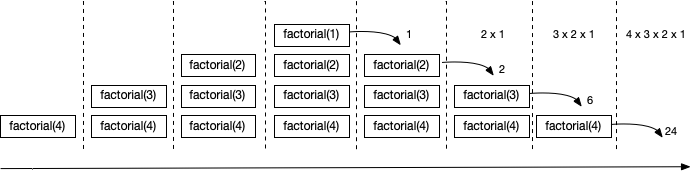

>A noção de *recursivo* pode ser visto como algo que se repete, potencialmente até ao infinito, utilizando a mesma forma. Nesta secção abordaremos **funções recursivas**, que são caracterizadas por serem definidas recorrendo à sua própria definição.

# Recursão
Comecemos por ilustrar o conceito de função recursiva com um exemplo clássico para este assunto, o cálculo do fatorial de um número natural. Ao seguir à letra a definição Matemática recursiva, obtemos a seguinte função.
A função diz-se **recursiva** quando inclui na sua definição uma invocação a si própria.



## Pilha de chamadas
Note-se que esta solução acima *não* é a melhor em termos de desempenho. Tal como explicado anteriormente, cada invocação dá origem a um bloco de memória na pilha de chamadas. Desta forma, a invocação de *factorial(4)* iria dar origem a uma profundidade de 4 na pilha de chamadas.

Quando se trata de um cálculo com valores elevados, a questão da profundidade da pilha de chamadas pode revelar-se um problema, tanto devido à memória necessária, como ao desempenho, dado que a alocação de blocos na pilha tem um custo também temporal.

## Stack overflow

Ao exceder a capacidade reservada para a pilha de chamadas ocorrerá um erro de *stack overflow*, como explicado na [secção anterior](funcoesdep). O erro poderá ocorrer devido a um elevado número de operações necessárias, ou devido à função não estar bem definida.



## Casos base e recursivo

Uma função recursiva terá sempre que ter pelo menos um **caso base**, que consiste num resultado da função que não envolva uma invocação à mesma. No exemplo dado inicialmente, o caso base é *if(n <= 1) 1*. O problema do último exemplo é que não é definido nenhum caso base.

Por oposição, temos os **casos recursivos**, onde o resultado da função inclui pelo menos uma invocação recursiva. No exemplo dado inicialmente, o caso recursivo é *else n * factorial(n - 1)*. No último exemplo a definição  tinha apenas o caso recursivo.

# Recursão na cauda

A recursão tem uma forma específica de ser definida designada por **recursão na cauda**. Esta forma requer que *todas* as invocações recursivas consistam na última avaliação necessária (*cauda*) para a fornecer o resultado.

Considere uma função para obter o primeiro dígito de um número inteiro. Por exemplo, para o número *2021* seria devolvido *2*. O resultado pode ser calculado fazendo sucessivas divisões inteiras por 10, até que o número seja menor que 10, correspondendo ao resultado. A definição seguinte é recursiva na cauda, dado que invocação recursiva aparece como sendo a expressão que dá origem ao resultado.



Quanto *todas* as invocações recursivas são na cauda, podemos declarar a função como sendo recursiva na cauda utilizando a palavra reservada **tailrec** (abreviatura de *tail recursion*). Desta forma, a implementação será optimizada por forma a que seja alocado apenas um bloco de memória na pilha de chamadas, e o espaço vai sendo reutilizado, perdendo os valores anteriores que não são necessários para o resultado.

## Recursão na cauda com função auxiliar
O exemplo inicial de cálculo de factorial *não* é recursivo na cauda, pois o resultado da função no caso recursivo é dado por *n * factorial(n-1)*. Ou seja, após a invocação recursiva ainda é necessário efetuar a multiplicação, e logo, ter o valor de *n* disponível. Quando por exemplo *factorial(1)* retorna, *factorial(2)* tem que ter o valor de *n* (2) para calcular o resultado.

Apresentamos agora adaptação da função inicial, por forma a que seja recursiva na cauda, evitando o problema de desempenho explicado anteriormente. Em muitos casos, as funções recursivas na cauda requerem que um parâmetro tenha um papel de variável que vai transitando o resultado de chamada em chamada.



## Funções aninhadas
Dado que em vários vários utilizar as funções recursivas por si só faz pouco sentido, podemos utilizar **funções aninhadas**. A definição de uma função aninhada é feita dentro do corpo de outra função, sendo que apenas poderá ser invocada por esta. A função aninhada pode aceder aos parâmetros da função "mãe".



>Utilizando funções recursivas é possível em teoria efetuar qualquer cálculo, e estas são a base do paradigma de programação **funcional**. Porém, por razões práticas ou necessidade de desempenho nalguns tipos de aplicação, torna-se necessário utilizar programação [procedimental](../04_estado).
