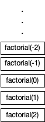

** BONECO **

A noção de *recursivo* pode ser visto como algo que se repete, potencialmente até ao infinito, utilizando a mesma forma. Nesta secção abordaremos **funções recursivas**, que são caracterizadas por serem definidas utilizando invocações a si próprias.

# Recursão
Comecemos por ilustrar o conceito de função recursiva com um exemplo clássico para este assunto, o cálculo do fatorial de um número natural. Ao seguir à letra a definição Matemática recursiva do desenho acima, obtemos a seguinte função.

<code>
fun factorial(n: Int): Int = if(n <= 1) 1 else n * factorial(n-1)
</code>

# Pilha de chamadas
Note-se que esta solução não é a melhor em termos de desempenho. Tal como explicado anteriormente, cada invocação dá origem a um bloco de memória na pilha de chamadas. Desta forma, a invocação de *factorial(4)* iria dar origem a uma profundidade de 4 na pilha de chamadas.

Quando se trata de um cálculo com valores elevados, a questão da profundidade da pilha de chamadas pode revelar-se um problema, tanto devido à memória necessária, como ao desempenho, dado que a alocação de blocos na pilha tem um custo também temporal.

# Erro: stack overflow

Ao exceder a capacidade reservada para a pilha de chamadas ocorrerá um erro de *stack overflow*, como explicado na [secção anterior](memoriapilha). O erro poderá ocorrer devido a um elevado número de operações necessárias, ou devido à função não estar bem definida.

No seguinte exemplo, a definição aparenta fazer sentido, mas faz com que a função se invoque a si mesma infinitamente.



# Casos base e recursivo

Uma função recursiva terá sempre que ter pelo menos um **caso base**, que consiste num resultado da função que não envolva uma invocação à mesma. No exemplo dado inicialmente, o caso base é *if(n <= 1) 1*. O problema do exemplo anterior é que não é definido nenhum caso base.

Por oposição temos o **caso recursivo**, onde o resultado da função inclui pelo menos uma invocação recursiva. No exemplo dado inicialmente, o caso recursivo é *else n * factorial(n-1)*. No exemplo anterior, a definição apenas tinha o caso recursivo.

Note-se que podem haver vários casos base e recursivos.

**TODO exemplo**

# Recursão na cauda

A recursão tem uma forma específica de ser definida designada por **recursão na cauda**. Esta forma requer que *todas* as invocações recursivas consistam na última avaliação necessária (*cauda*) para a avaliação do resultado.

Considere uma função para obter o primeiro dígito de um número inteiro. Por exemplo, para o número *2019* seria devolvido *2*. O resultado pode ser calculado fazendo sucessivas divisões inteiras por 10, até que o número seja menor que 10, correspondendo ao resultado. A definição seguinte é recursiva na cauda, dado que invocação recursiva aparece como sendo a expressão que dá origem ao resultado.



Quanto *todas* as invocações recursivas são na cauda, podemos classificar a função como sendo recursiva na causa utilizando a palavra reservada **tailrec** (abreviatura de *tail recursion*). Desta forma, a implementação será optimizada por forma seja alocado apenas um bloco de memória na pilha de chamadas, e o espaço vai sendo reutilizado, perdendo os valores anteriores que não são necessários para o resultado.

O exemplo inicial *não* é recursivo na cauda, pois o resultado da função no caso recursivo é dado por *n * factorial(n-1)*. Ou seja, após a invocação recursiva ainda é necessário efetuar a multiplicação, e logo, ter o valor de *n* disponível. Quando por exemplo *factorial(1)* retorna, *factorial(2)* tem que ter o valor de *n* (2) para calcular o resultado.

## Recursão na cauda em função auxiliar



# Funções aninhadas

acesso parametros da mãe

<kotlin>
fun sqrt2(n: Double) : Double {
    tailrec fun aux(r: Double) =
        if(approxEqual(r * r, n)) r
        else sqrt2((r + n / r) / 2)
    return aux(r / 2)
}
</kotlin>

# Conclusão

Utilizando funções recursivas é possível em teoria efetuar qualquer cálculo, e estas são a base do paradigma de programação **funcional**. Porém, por razões práticas ou necessidade de desempenho nalguns tipos de aplicação, torna-se necessário utilizar programação **procedimental**, onde os cálculos são efetuados manipulando valores guardados em variáveis (a abordar num [capítulo posterior](../04_variaveis)).
