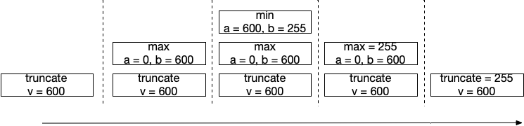
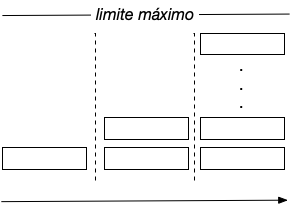

As [funções dependentes](funcoesdep) fazem uso de outras funções, que por sua vez poderão fazer uso de outras funções. Nesta secção detalharemos o processo de execução em termos de memória.

# Pilha

Em computação existe uma forma elementar de organizar dados a que chamamos  **pilha** (*stack*). A metáfora com base no mundo real tem o origem na noção de *pilha de coisas* (e não pilha de energia), onde elementos de algum tipo (p.e. livros, paletes, caixotes) são empilhados em altura. Desta forma, a única forma de manipular a pilha é removendo ou acrescentando elementos no topo (caso contrário a pilha desmorona-se).

Suponhamos que temos três caixotes (*A*, *B*, *C*) e vamos organizá-los numa pilha. Colocamos *A* na base, depois *B* em cima, e por fim *C*. Nesta altura, para chegar a *B* teremos que remover *C* do topo.

Esta é a metáfora de pilha que é utilizada em software, veremos agora como é aplicada no encadeamento de invocação de funções.

# Pilha de chamadas

A **pilha de chamadas** (*call stack*) é a estrutura de armazenamento de valores que é utilizada durante a execução de um programa. Quando uma função executa é colocado um pedaço de memória na pilha de chamadas. A quantidade de memória está relacionada com o número e tipo dos valores que a função manipula. Ao ser invocada outra função, é reservado outro espaço no topo da pilha tendo em conta a memória necessária para a mesma, e assim sucessivamente. Quanto uma função retorna, o seu espaço no topo da pilha é libertado, e a função que a invocou prossegue.

Com base no exemplo apresentado anteriormente, ilustramos o funcionamento da pilha de chamadas para a avaliação de *constrain(600, 0, 255)*.

<code>
fun max(a: Int, b: Int) = if(a > b) a else b
fun min(a: Int, b: Int) = if(a < b) a else b
fun constrain(v: Int, min: Int, max: Int ) = max(min, min(v, max))
</code>

Iremos utilizar o termo **profundidade** para nos referirmos ao número de blocos que estão na pilha de chamadas. Desta forma, o exemplo anterior requer profundidade 3.

# Erro: stack overflow

 Dado que a pilha ocupa espaço em memória, a capacidade da pilha de chamadas não é infinita, sendo que depende do ambiente de execução que utilizamos (memória disponível, sistema operativo, linguagem, configuração de execução). Assim sendo, quando a profundidade limite é atingida devido a um número muito elevado de chamadas encadeadas ocorre um erro de *stack overflow* (transbordo da pilha).

# Sumário

Cada execução de uma função requer um pedaço de memória que depende do número de valores que manipula. A memória da execução de funções encadeadas é organizada numa pilha que tem um limite máximo, e ocorre um erro de *stack overflow* quando este é ultrapassado. Na [próxima secção](funcoesrec) são abordadas funções recursivas, passíveis de manifestarem este erro.
