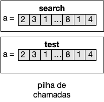

>A [secção anterior](vetores) introduziu a alocação de vetores. Cada vetor requer um pedaço de memória disponível no programa, que não é infinita. Nesta secção abordamos a noção de *referência* e as bases do funcionamento da gestão de memória *heap*.

A maioria das linguagens de programação modernas, tal como Kotlin, dispensam os programadores da gestão da memória explicitamente. Em linguagens mais antigas (p.e. C), quando um pedaço de memória como um vetor já não é necessário no programa, cabe ao mesmo dar uma instrução para que a mesma seja liberta. Esta responsabilidade dá frequentemente origem a defeitos no software conhecidos como *memory leaks* (fugas de memória), quando o programa não foi devidamente escrito por forma a que pedaços de memória que já não são necessários sejam libertos. Para além da utilização de espaço desnecessariamente, um programa que aloca memória intensivamente pode ser interrompido por falta de memória disponível.

# Alocação de memória
O espaço de um vetor resulta de uma alocação de um segmento de memória *heap* disponível ao programa em execução (uma tradução possível de *heap* é "amontoado", mas não será utilizada aqui). Cada alocação de um novo vetor resulta sempre num custo de memória diretamente relacionado com o seu comprimento. Para além da ocupação de memória, a alocação de grandes pedaços de memória tem também um custo temporal.

Tal como a pilha de chamadas (*stack*) não tem memória infinita, também a memória na *heap* é limitada, sendo a capacidade determinada pelo Sistema Operativo (e limitada consoante a memória RAM disponível). Quando programa tenta alocar mais memória do que disponível ocorre um erro de falta de memória. É possível lançar um programa com diferentes quantidades de memória disponível, mas isso estará sempre limitado pelo total de memória RAM da máquina e por outras aplicações que estejam a correr.



# Referências

Ao contrário da pilha de chamadas, onde cada segmento detém valores que não são partilhados por outros segmentos, as alocações na memória *heap* são partilhadas pelos segmentos da pilha de chamadas. Esta partilha é alcançada através de **referências** (também designadas por *apontadores*).  Estas consistem em valores que detêm endereços na memória *heap*, permitindo localizar elementos alocados em memória. Tanto os vetores como os valores compostos (e também [objetos](../06_objetos/objetos), a ver à frente) são guardados na *heap* e tratados através de referências.



Ao partilhar memória entre execuções de funções evitamos a cópia de pedaços de memória (potencialmente grandes) ao efetuar invocações. Suponhamos um programa que manipula um vetor muito grande (pe. 1Gb), e que necessita de efetuar uma pesquisa nesse vetor realizada por outra função. Ora, sem o mecanismo das referências seria necessário copiar toda a memória para a função de pesquisa, o que teria um custo de espaço e tempo. Este hipotético caso, pois tal não é possível em Kotlin (e várias outras linguagens), é ilustrado na figura em baixo.

Nalgumas linguagens mais antigas (pe. C), é possível ter referências para segmentos de memória da pilha de chamadas, mas isso  não é possível em linguagens modernas, devido aos problemas que pode facilmente causar. (Como lidar com uma referência para um segmento da pilha de chamadas que já foi apagado?).

## Passagem de referências entre funções





# Libertação de memória
À medida que um vetor deixa de ser utilizado no programa, a memória que o mesmo ocupava é libertada automaticamente. O processo que efetua esta tarefa é chamado *garbage collection* ("recolha de lixo", literalmente). Ou seja, pedaços de memória que deixam de poder ser utilizados são considerados "lixo", e logo, o espaço correspondente pode ser recuperado.

{% include code code="
fun median(a: IntArray) {
    val asorted = sorted(a)
    return asorted[asorted.size/2]
}

fun test() {
  val numbers = intArrayOf(1, 5, 4, 3, 2)
  val med = median(a)
}
"
msg="<b>Garbage collection</b>. Supondo a existência de uma função <b>sorted</b> que dado um vetor de inteiros devolve outro com os elementos do primeiro por ordem crescente, a função <b>median</b> em baixo obtém a mediana consultando o(s) elemento(s) do meio. O vetor ordenado obtido no primeiro passo foi alocado pela função <b>sorted</b>. Porém aqui é apenas necessário temporariamente para obter o resultado final e não faz parte do mesmo. Assim que a função <b>median</b> termina já não existem referências na pilha de chamadas para o vetor ordenado. Isto implicará que o mesmo será marcado para libertação de memória (o que não ocorre necessariamente de forma imediata)."
img="imagens/gc.png"
%}

# Fugas de memória (memory leaks)
Ainda que os mecanismos de *garbage collection* libertem memória automaticamente, é possível escrever programas que dão origem a fugas de memória. Isso acontece quando as estruturas utilizadas guardam referências para memória que já não é necessária para a lógica do programa, mas que ainda está acessível, fazendo com que a libertação automática não ocorra.

O caso seguinte é adaptado do que em tempos acontecia nos valores *String* (sequência de caracteres), muito utilizados em Java.





>Dada a memória abundante, nos tempos atuais não é frequente um programador ter que ser muito zeloso face à alocação de memória. Porém, é importante entender o que acontece durante a execução para que se consiga detectar e ultrapassar problemas que possam surgir.
