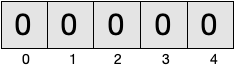
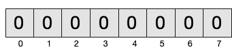
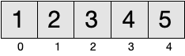
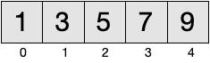

 >Nesta secção ilustraremos o conceito de **vetor** com números inteiros (*int*). Para já apenas será abordada a criação e leitura de vetores, e não a possibilidade de modificação.

**Vetores** são forma mais elementar de lidar com conjuntos de dados. Um vetor consiste numa sequência de valores de determinado tipo. O **comprimento** do vetor corresponde ao número de elementos. Os elementos são acedidos mediante **índices**, tendo o primeiro elemento índice zero e o último comprimento menos um. No exemplo seguinte, temos um vetor com comprimento 5, sendo os índices válidos {0, 1, 2, 3, 4}.

# Alocação e inicialização

## Inicialização por omissão

Ao alocar um novo vetor temos que fornecer o comprimento (número de elementos desejado), bem como o tipo dos mesmos. Nesta secção iremos utilizar o tipo *IntArray* para vetores de inteiros.

No exemplo seguinte é inicializado um vetor de inteiros com comprimento 7. Os elementos iniciais contidos no vetor após inicialização são valores determinados por omissão. No caso de valores numéricos, o valor por omissão é o zero.





## Inicialização com função para gerar elementos

Por forma a alocar um vetor que contenha outros valores iniciais que não os por omissão, é possível fornecer uma função de inicialização que será utilizada para gerar os elementos. Dado o índice de uma posição, esta função deverá devolver qual o valor a colocar na mesma.

No exemplo seguinte, é criado um vetor com os primeiros 10 números naturais ({1..10}). Ao parâmetro *i* da expressão lambda serão atribuídos os valores {0..9} (dadas as 10 posições do vetor), sendo que a expressão para obter os elementos é *i* mais 1, ou seja, {1..10}.



No exemplo seguinte são gerados os primeiros 10 números pares, sendo que no código foi utilizada a simplificação sintática recorrendo a *it* para o parâmetro único.



## Inicialização com elementos literais

Outra forma possível de inicializar um vetor é fornecer uma sequência dos seus elementos. Neste caso, o comprimento do vetor corresponderá ao número de elementos fornecidos. No exemplo em baixo são fornecidos 5 elementos, e logo o vetor terá esse comprimento e os valores {1, 3, 5, 7, 9}.



## Comprimento
O comprimento de um vetor pode ser consultado através do campo **size**. A partir deste valor é possível saber qual o último índice válido (*size - 1*). Porém, dado que é muito frequente a necessidade de saber esse valor, existe um campo **lastIndex** que o fornece.



O comprimento de um vetor é fixo. Uma vez alocado um vetor, já não é possível alterar o seu comprimento. Ao tratar um conjunto de valores que necessita de mais espaço para outros elementos, torna-se necessário alocar um novo vetor.

O comprimento de um vetor pode ser zero, isto é, um vetor vazio sem elementos. Esta possibilidade é útil para representar conjuntos de dados vazios. Por exemplo, a interceção dos conjuntos {1, 2} e {3, 4} corresponde ao conjunto vazio ({}). Uma pesquisa para a qual não foram encontrados resultados, também consiste num conjunto vazio.



# Acesso por indexação
O acesso a um elemento de um vetor é feito mediante um *índice*, o qual terá que estar compreendido no intervalo [0, *último índice*]. A notação para nos referirmos ao índice consiste em utilizar parêntesis retos, como exemplificado em baixo.



## Acesso com índice inválido
Um dos erros mais frequentes quando manipulamos vetores consistem em tentar aceder a uma posição do vetor com um valor de índice inválido (frequentemente com a diferença de uma unidade dos limites válidos). Este erro será manifestado numa interrupção da execução com a exceção *ArrayIndexOutOfBounds*.



# Funções que alocam vetores
Utilizando a inicialização de vetores com função geradora, podemos definir funções que alocam  e devolvem vetores.





# Funções sobre vetores





>Vetores consistem numa estrutura de dados elementar que não é frequentemente utilizada diretamente no desenvolvimento de aplicações, devido essencialmente a não ser prático. O normal é utilizar [*listas*](../05_colecoes/listas) ou outras estruturas. Porém, é importante dominar a manipulação de vetores para efeitos de implementação de algoritmos e estruturas de dados ou em situações que requerem uma optimização de desempenho. A [secção seguinte](referencias) aborda a forma como os vetores são guardados em memória. 
