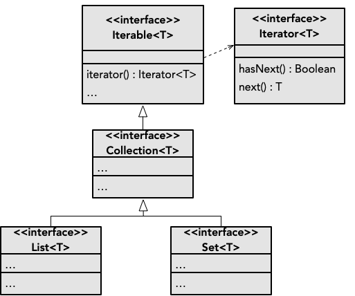

> Nas secções anteriores abordámos as abstrações de **lista** e **conjunto**. É possível constatar que ambas têm uma natureza semelhante, e partilham operações comuns (pe. *size*, *contains*, *add*). Embora com propriedades ligeiramente diferentes, tanto uma lista como um conjunto consiste numa **coleção** de elementos.

# Iteradores
A abstração *Collection* representa as características comuns a listas e conjuntos (e possivelmente outros). Muito frequentemente processamos uma coleção através de um "varrimento", i.e. uma passagem pelos seus elementos. Este tipo de processo designa-se por **iteração**. *Collection* é por sua vez baseada noutra abstração chamada *Iterable*, para representar algo iterável de onde possamos obter elementos.

O processo de iteração é representado na abstração *Iterator*. Este objeto controla o progresso da iteração, solicitando sucessivamente o próximo elemento até que não existam mais para processar. A estrutura típica de utilização de um iterador na sua forma mais elementar é a seguinte.



Neste excerto de código, estamos processar uma lista de inteiros. Se se tratasse de um conjunto, o código seria igual. Desta forma, podemos utilizar o tipo *Collection* por forma aceitar tanto listas como conjuntos. No seguinte exemplo temos uma função que devolve o somatório dos inteiros de uma coleção.



Esta função pode ser utilizada tanto com uma lista, como com um conjunto.


Suponhamos agora que temos uma função para calcular o produto de uma coleção de inteiros. Note-se que há bastante semelhança com a função anterior, no que toca ao processo de iteração.



Por forma a evitar que se repita o código relativo à iteração, podemos ter uma função que dada uma coleção, recebe uma função com a acção a realizar com cada elemento.



Desta forma, poderíamos efetuar os cálculos do somatório e produto da seguinte forma.



Por fim, a função poderá ficar ainda mais genérica utilizando *Iterable* e um tipo genérico para os elementos.





Dado que a necessidade de iterações é muito comum, existe na linguagem uma função pré-definida para esse processo chamada *forEach* ("para cada"). Esta função é muito semelhante a *iterate*, apenas difere em estar definida como sendo de instância.



# Transformações

As bibliotecas de Kotlin incluem muitas funções para processamento de coleções, das quais abordaremos aqui as mais frequentes. A lógica de funcionamento segue o princípio *map-reduce* originário da programação funcional.

## Mapeamento
Por vezes é necessário transformar os elementos de uma coleção de forma uniforme. Para este propósito existe a operação de mapeamento.
Neste tipo de transformação, uma coleção é produzida a partir da transformação de cada um dos elementos da mesma. A função *map* recebe a função que define a transformação a efetuar.



## Seleção
Frequentemente temos que selecionar elementos de uma coleção, deixando outros fora do processo. Isto pode ser feito com a operação *filter* que recebe uma função booleana que decide quais os elementos a incluir.



Outra forma de selecionar elementos é através da obtenção de elementos distintos (únicos, sem duplicados), utilizando a operação *distinct*.


## Ordenação
Para além da transformação e seleção de elementos, também é frequente alterar a sua ordem mediante um critério de ordenação.

Quanto estamos perante uma coleção de elementos numéricos podemos utilizar a operação *sorted* para ordenação crescente, e *sortedDescending* para ordenação decrescente.



### Critérios de ordenação específicos

Por forma a definir critérios de ordenação específicos para um tipo T, utilizamos a operação *sortedWith* fornecendo uma função que dados dois valores do tipo T decide qual tem prioridade.

Isto é feito através da interface *Comparable*, que define uma função *(a: T, b: T) -> Int* para realizar a comparação. Dados dois elementos (*a* e *b*) do tipo T, o inteiro resultante terá a seguinte interpretação em termos de ordem:

- zero: *a* e *b* são considerados empatados

- negativo: *a* é prioritário em relação a *b*

- positivo: *b* é prioritário em relação a *a*

No exemplo seguinte, a lista de strings é ordenada por ordem de maior comprimento.



# Redução
As operações anteriores transformam, filtram, ou reordenam elementos de uma coleção. O processo de **redução** consiste em calcular algo a partir dos elementos resultantes dessas transformações.

A operação *reduce* consiste num processo que parte do primeiro elemento da coleção,  e utilizando uma função fornecida efetua um cálculo com o segundo elemento. Isto dará origem a um resultado que por sua vez será combinado com o terceiro elemento, e assim sucessivamente, até ao último.



Com a operação *reduce*, o resultado final é necessariamente do tipo dos elementos da coleção, o que pode ser uma limitação.

A operação *fold* oferece outra forma de fazer redução semelhante, porém, o tipo de resultado pode ser o que queiramos. O valor inicial do resultado é fornecido, e a iteração começa no primeiro elemento da coleção (ao invés *reduce*, que começa no segundo).



# Funções auxiliares
As bibliotecas de Kotlin oferecem algumas funções auxiliares comuns sobre coleções, das quais destacamos aqui algumas das que serão utilizadas com mais frequência. Muitas destas funções têm variantes com nomes relacionados que não ilustramos aqui.

## Contagem
A contagem de elementos é um processo extremamente comum. Podemos faze-lo através de *count*, fornecendo o critério que decide se um elemento é para considerar na contagem.



## Procura
Outra operação frequente é procurar por um elemento numa coleção que satisfaça determinado critério (elemento esse que pode não existir). Para tal podemos utilizar *find*, fornecendo o critério de procura à semelhança de *count*. A procura é feita do início para o fim da coleção, sendo que o primeiro elemento que satisfaça o critério será devolvido. Será devolvido *null* caso não exista tal elemento.



## Caracterização

Ao lidarmos com coleções numéricas, é muito frequente necessitarmos de procurar por valores mínimos ou máximos, bem como calcular somatórios e médias. Existem funções de extensão para estes objetivos que apresentamos na tabela em baixo.

| Função | Descrição |
|------|------|
| minOrNull | Obter valor mínimo (ou *null* no caso de coleção vazia) |
| maxOrNull | Obter valor máximo (ou *null* no caso de coleção vazia) |
| sum | Calcular somatório |
| average | Calcular média |

O exemplo seguinte demonstra como utilizar, por exemplo, a função *average*.


