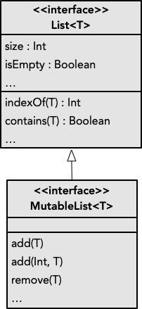

O tipo mais elementar de coleção é a **lista**, que consiste numa sequência de valores, passíveis de serem indexados com base zero (o primeiro elemento tem índice zero). Existem duas abstrações para manipular listas: apenas leitura e leitura e escrita.

# Listas para leitura (*read-only*)

Uma lista apenas para leitura (*read-only List*) pode ser criada desta seguinte forma (o tipo de *val* pode ser omitido, pois isso pode ser inferido da enumeração de elementos).



A tabela seguinte apresenta as operações principais para List\<T\>, explicitando o seu custo temporal, e com exemplos sobre a lista *list* acima (List\<Double\>). Realçamos as operações com custo linear, pois numa situação onde estas sejam utilizadas intensivamente, deverá ser ponderada outra abstração.

| Operação | Descrição | Custo | Exemplo | Resultado |
| ----------- | ----------- |--------|
| size | Número de elementos | Constante | list.size | 5 |
| isEmpty  | Lista é vazia? | Constante | list.isEmpty | false |
| first | Primeiro elemento (requer lista não vazia) | Constante | list.first | 0.2 |
| last | Último elemento (requer lista não vazia) | Constante | list.last | 1.0 |
| lastIndex | Último índice (-1 caso lista vazia) | Constante | list.lastIndex | 4 |
| indices | Intervalo de índices válidos | Constante | list.indices | 0..4 |
| get(Int) | Valor em índice | Constante | list.get(0) | 0.2 |
| indexOf(T) | Índice de elemento (-1 caso não exista) | Linear | list.indexOf(0.6) | 2 |
| contains(T) | Lista contém elemento? | Linear | list.contains(1.0) | true |



## Funções sobre listas
Tendo uma lista para leitura apenas podemos escrever funções que se baseiam nos elementos da mesma para produzir um resultado. Não é possível alterar a lista (diretamente), pois não temos operações disponíveis para tal em *List*.



# Listas mutáveis

Uma lista mutável (*MutableList*) é uma abstração que estende *List* com operações para modificar a lista. Ou seja, temos disponíveis todas as operações de *List*, mais um conjunto de operações para modificar a lista.



As operações principais adicionais às da tabela anterior são apresentadas em baixo, à semelhança da tabela anterior. Tal como nalgumas operações de leitura, neste caso também temos operações lineares.

| Operação       | Descrição      | Custo | Exemplo | Estado da lista|
| ----------- | ----------- |--------|
| add(T) | Adiciona elemento no final | Constante | list.add(1.2) | [0.2, 0.4, 0.6, 0.8, 1.0, <u>1.2</u>] |
| add(Int, T)  | Adiciona elemento em índice | Linear | list.add(0, 0.0) | [<u>0.0</u>, 0.2, 0.4, 0.6, 0.8, 1.0] |
| remove(T) | Remove elemento (caso exista) | Linear | list.remove(0.6) | [0.2, 0.4, 0.8, 1.0] |
| removeAt(Int) | Remove elemento em índice | Linear | list.remove(0) | [0.4, 0.6, 0.8, 1.0] |
| set(Int, T) | Altera elemento em índice | Constante | list.set(1, 0.3) | [0.2, <u>0.3</u>, 0.6, 0.8, 1.0] |
| clear() | Remove todos os elementos | Constante | list.clear() | [] |



## Procedimentos sobre listas

Tendo acesso a uma lista mutável, podemos definir *procedimentos* que alteram a mesma.



# Criação

A forma utilizada atrás para criar listas consiste numa enumeração de elementos. Porém, para além de casos de teste, normalmente criamos listas de uma forma diferente.

## Listas vazias

Por vezes é necessário representar listas vazias. Neste caso, dado que não são fornecidos elementos concretos, não é possível inferir o tipo dos seus elementos. Desta forma, torna-se necessário ser explícito.



No caso das listas mutáveis, utilizamos a mesma função apresentada anteriormente sem argumentos. No exemplo seguinte, o tipo de elementos está explicito na invocação, em alternativa à forma anterior.



## Geração de elementos
Outra possibilidade é a criação de uma lista fornecendo o seu tamanho e uma função para gerar os elementos para cada índice. O seguinte caso gera uma lista com os números de 1 a 100.



## Cópia
Por vezes temos necessidade de trabalhar com uma cópia de outra lista. Esta necessidade será no sentido de a alterar, pois caso apenas precisemos de leitura, não faz sentido efetuar cópias.

Se a lista original seja de leitura, teremos necessariamente que fazer uma cópia. O outro caso é termos uma lista mutável original que queremos preservar.
Para tal, temos a operação *toMutableList()*, que efetua uma cópia da lista original.



# Sumário
A lista é a estrutura de dados mais comum quando programamos. Porém, convém estar ciente das suas propriedades, em especial às operações com custo linear que poderão causar problemas de escalabilidade.
