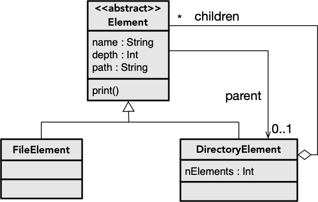

A organização de ficheiros em diretórios consiste numa árvore, onde os diretórios são nós compostos (que contêm filhos) e os ficheiros são nós folha. Este tipo de estrutura pode ser representada através de uma estrutura de dados recursiva (padrão de desenho [Objetos Compostos](../../padroesdesenho/objetoscompostos)), tal como ilustrado na figura. Os elementos podem ser de dois tipos: ficheiros ou diretórios (a class Element é abstrata). Os diretórios contêm outros elementos, os quais podem ser outros diretórios ou ficheiros. Todos os elementos terão o seu pai definido (diretório), porém há a possibilidade do pai não estar definido (para o caso da raiz).

### 1. Estrutura de dados (Objetos Compostos)

Implementar a estrutura de dados de acordo com o que é apresentado no diagrama. As propriedades deverão ser calculadas, por forma a que uma alteração na estrutura (pe. acrescentar um ficheiro) resultará em valores diferentes.

- *nElements* significa número total elementos, considerando a contagem recursivamente (pelos subdiretórios).
- *depth* refere-se à profundidade na árvore (elemento raiz (*root*) terá profundidade zero).
- *print* imprime a árvore de ficheiros na consola.

Experimente a instanciação destas classes com pelo menos três níveis de profundidade, testando as propriedades.

### 2. Carregamento de árvore

Escreva uma função de extensão de File para criar uma árvore, instanciando as classes desenvolvidas em (1).



Experimente o carregamento de um diretório local, imprimindo a árvore na consola.


