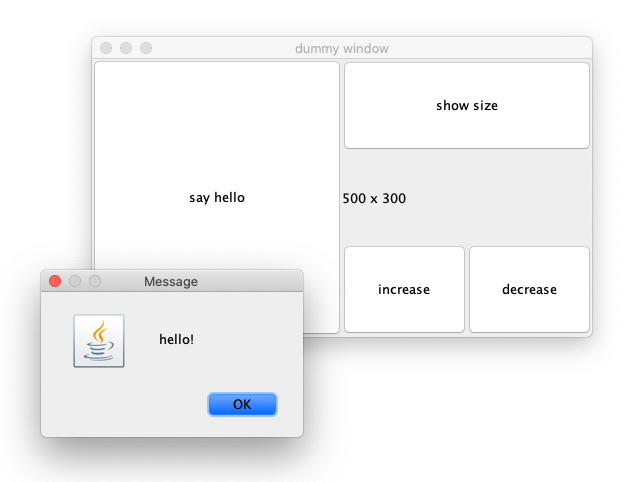

As linguagens específicas de domínio, vulgarmente conhecidas pela sigla DSL (*domain specific language*) são linguagens de software especializadas para um tipo de problema (por oposição às *general-purpose languages* tais como Kotlin, Java Python, etc). A especificidade de uma DSL faz com que o âmbito da utilização da mesma seja reduzido. Porém, uma das principais vantagens de uma DSL é fornecer uma forma de expressão prática e adaptada ao domínio em questão.

Uma DSL *externa* é aquela que tem a sua infraestrutura independente, tendo a liberdade sintática total, podendo até ser uma DSL com representação gráfica. HTML ou SQL são consideradas DSLs dado que são aplicáveis num aspeto de desenvolvimento do sistema. A utilização da plataforma [OutSystems](https://www.outsystems.com) é baseada em parte numa DSL gráfica.

Por outro lado, uma DSL *interna* é aquela cuja sintaxe está embebida noutra linguagem existente (chamemos-lhe a linguagem "mãe"). As DSLs internas são normalmente desenvolvidas para problemas menos generalistas, como por exemplo para apoiar a utilização de componentes proprietários.

Ao passo que as DSLs externas não têm restrições quanto à sua forma, são dispendiosas de implementar, pois a sintaxe e semântica terão que ser definidas de raiz, ao que acresce a necessidade de ter um bom editor para a mesma. As DSLs internas estão constrangidas pelas possibilidades sintáticas da linguagem mãe, mas têm um custo de desenvolvimento reduzido, pois toda a infraestrutura da linguagem já existe. Por outro lado, as questões de integração com a linguagem mãe são praticamente inexistentes.

Esta secção aborda um conjunto de mecanismos disponíveis em Kotlin que facilitam o desenvolvimento de DSLs internas, oferecendo alguma liberdade sobre a sintaxe. Frequentemente, uma DSL interna é baseada num conjunto de classes (ou biblioteca) já existentes, e o seu papel é fornecer uma interface para as mesmas que:
1. alivie a densidade da sintaxe, permitindo descrições mais sucintas
2. facilite a legibilidade, não só por (1) mas por formas de compor objetos mais explícitas
3. facilite a manipulação do código devido a (1, 2)

# Caso: Java Swing

A biblioteca [Java Swing](https://en.wikipedia.org/wiki/Swing_(Java)) foi desenvolvida como parte integrante do Java, e é considerada obsoleta atualmente, ainda que exista software de grande complexidade assente sobre a mesma (pe. [IntelliJ IDEA](https://www.jetbrains.com/idea/)). Java Swing tem alguns aspetos da sua API que podiam estar melhor desenhados, o que torna este caso interessante para fornecer uma melhor API por via de uma DSL interna.

Em baixo podemos ver uma pequena aplicação exemplo, e código correspondente utilizando a biblioteca diretamente.



Podemos observar as seguintes características (negativas):
- alguma verbosidade, resultante de ser necessário utilizar variáveis para instanciar, configurar, e compor os componentes gráficos;
- necessidade de sintaxe para objetos de valor compostos, tais como *Dimension* e *Point*;
- necessidade de invocar *add* para incluir os componentes no componente pai, o que pode ser facilmente esquecido por lapso;
- dificuldade em entender a composição dos elementos (quem é filho de quem);
- dificuldade em conhecer alguns aspetos da API menos óbvios, tais como:
  - *GridLayout(0, 1)*, sendo o zero indicador de número de linhas variável;
  - *frame.isVisible = true* como sendo a forma de abrir a janela;

# DSL Interna
Ao longo desta secção iremos expor por partes os mecanismos de Kotlin que permitirão utilizar a seguinte sintaxe para exprimir a aplicação acima, a qual consistirá na DSL interna. O código em baixo exprime exatamente o mesmo que o de cima, e note-se que todos os pontos negativos do último são de certa forma aliviados com esta sintaxe.



De seguida apresentamos excertos da definição da DSL, o código completo pode ser obtido [aqui](code/SwingDSL.kt).

## Notação infixa
A [notação infixa](../02_funcoes/funcoesvalores) permite que uma função de instância *f* com um parâmetro seja invocada com a sintaxe *this f arg* (em vez de *this.f(arg)*).



## Extensões de tipos
É possível estender classes externas (cujo código não está no nosso controlo), por exemplo provenientes de uma biblioteca, com propriedades e funções. No seguinte exemplo, a classe *Dimension* do Swing é estendida com a propriedade *asText* que nos fornece os valores do objeto de forma textual.



## Embrulhos (wrappers)
Para efeitos de uma DSL, é frequentemente útil definir classes cujos objetos "embrulham" outros (*wrappers*) com vista a possibilitar conveniências sintáticas. No exemplo seguinte, temos esta situação com a classe *Window* que embrulha um objeto *JFrame*. Nestas situações é normal o recurso a delegação, i.e. as chamadas na classe *wrapper* são encaminhadas para o objeto embrulhado. Com Kotlin temos a possibilidade de definir delegações de propriedades, como no caso da propriedade *title*.



## Lambdas com instância implícita (receiver)
A utilização de lambdas em Kotlin possibilita uma conveniência sintática que aquando da definição da expressão lambda ...
Este tipo de lambdas dispensa a referência à instância, tornando a sintaxe menos verbosa.



Podemos também acrescentar à classe *Window* uma função para preenchimento do seu conteúdo utilizando também lambdas com instância implícita.



## Definição de operadores
A solução anterior pode ser ainda mais simplificada com recurso à [definição de operadores](../02_funcoes/funcoesvalores). No código seguinte, temos uma função para criação de um painel semelhante à do preenchimento da janela, utilizando um embrulho (*Panel*) para definir o operador unário *+* para os objetos *JComponent*, permitindo que estes sejam adicionados ao painel através do mesmo.



Quando utilizamos expressões lambda com instância implícita aninhadas podemos aceder a membros de instâncias relativos a níveis superiores. O exemplo ilustra o acesso a *size* da instância de *window* (dois níveis acima).

Por fim, ilustramos mais duas definições de operadores para permitir definir um identificador a componentes gráficos e respetivo acesso. O operador *-* quando utilizado entre um componente e uma *string* no contexto de *Window* dará origem à indexação do mesmo numa tabela. Por outro lado, definimos o operador de acesso indexado *[...]* (*get*) por forma a poder obter elementos da janela por identificador.

{% include code code="
class Window {
    ...
    private val childrenIds: MutableMap<String, JComponent> = mutableMapOf()
    ...

    operator fun <T : JComponent> T.minus(id: String): T {
        childrenIds[id] = this
        return this
    }

    operator fun <T : JComponent> get(a: String): T {
        check(childrenIds.contains(a))
        return childrenIds[a] as T
    }
}

val w = window {
    content {
      +label(\"?\") - \"question\"
    }
}
val l : JLabel = w[\"question\"]
l.text = \"pergunta\"
w.open()
"%}
