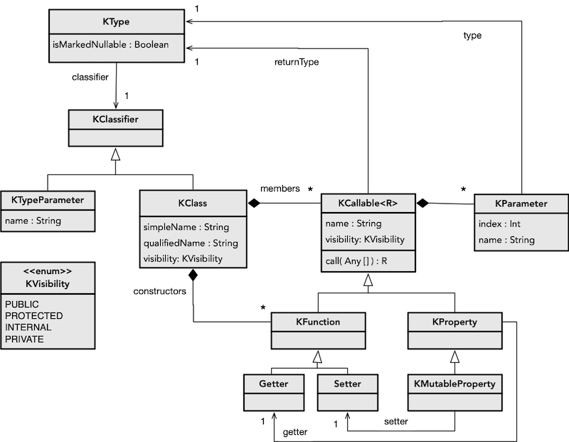

As primitivas de reflexão em Kotlin têm como base as do Java, sendo possível utilizar diretamente as deste. Contudo, são definidas classes adicionais próprias de Kotlin, que sumarizamos no diagrama UML.

*KType* representa a presença de um tipo, que pode estar marcado como *nullable* ou não (utilizando **?**). O tipo propriamente dito é dado por *KClass* (ou *KTypeParameter* para os genéricos). Uma classe é composta por membros, sejam propriedades (*KProperty*) ou funções (*KFunction*), bem como construtores (que são tratados como funções). Todos estes são subtipos de *KCallable*, isto é, algo que se pode invocar e devolvem algo (*returnType*), e o primeiro argumento da invocação é o próprio objeto.
As funções e construtores poderão ter mais parâmetros (*KParameter*). As classes e os seus membros podem ter diferentes níveis de visibilidade (*KVisibility*).

# Reflexão estática
A reflexão estática é aquela que consiste em analisar elementos de um programa, mas sem efetuar nenhum tipo de operação com os mesmos.

Dada uma classe/módulo, é-nos permitido saber:
- quais as suas propriedades (nome, tipo, modificadores)
- quais os construtores disponíveis (tipo de parâmetros)
- quais as operações disponíveis (nome, tipo de parâmetros, modificadores)

Podemos também obter as anotações presentes em cada um dos elementos acima, um tema a abordar na [próxima secção](anotacoes).

## Classe
O primeiro passo para fazer uso de reflexão é obter uma referência para uma classe que pretendemos analisar, utilizando **::class**.



No exemplo acima a classe é conhecida, porém muitas vezes queremos trabalhar de forma genérica com objetos cujas classes não conhecemos.





## Propriedades
Podemos aceder às propriedades da classe através de *declaredMemberProperties*, contendo objetos *KProperty*. Esta forma de consulta excluí as propriedades herdadas (para tal, utilizar *memberProperties*).



## Construtores
Os construtores de uma classe podem ser obtidos através de *constructors*, sendo que existirá sempre pelo menos um construtor. Ainda que a classe não defina um construtor, existirá um primário por omissão. O código seguinte obtém o número de construtores da classe.



## Operações
As operações disponíveis de uma classe podem ser obtidas através de *declaredMemberFunctions*. Tal como nas propriedades, esta forma de consulta excluí as funções herdadas (para tal, utilizar *memberFunctions*). O seguinte exemplo faz uma procura de uma função que não tenha parâmetros (encontrando *inc()*).



Ao consultar os parâmetros com *valueParameters* estamos a excluir o parâmetro implícito (*this*) (para o incluir utilizaríamos *parameters*).

# Reflexão dinâmica
A reflexão dinâmica é aquela que, dados os elementos estáticos recolhidos da forma explicada anteriormente, os utiliza de forma indireta, isto é, sem *depender* dos identificadores concretos.  

## Atributos
O seguinte exemplo recolhe o nome de cada propriedade, sendo invocado *call* com o objeto do qual se pretende a propriedade. Se for passado um objeto cuja classe não tem a propriedade teremos um erro de execução.



## Construtores
No seguinte exemplo apresentamos duas formas de invocar construtores por reflexão. No primeiro caso, é obtido o construtor primário (*primaryConstructor*), e invocado como uma função. O segundo caso consiste numa operação de conveniência para invocar o construtor sem argumentos. Caso não exista, teremos um erro de execução. Logicamente, os argumentos passados na chamadata



## Operações
Por fim, ilustramos como invocar uma operação por reflexão, que é semelhante à invocação de construtor. Contudo, realçamos que perante uma operação num objeto é necessário passar o mesmo como primeiro argumento.


