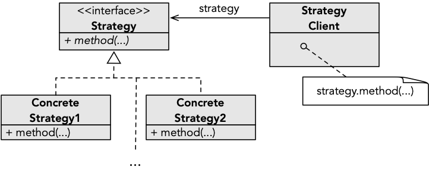

**Estratégia** (*stragegy*) é um dos padrões de desenho mais simples, que consiste em permitir variar algum algoritmo/critério num sistema, permitindo a coexistência de várias alternativas. A solução passa por abstrair as operações que se querem permitir variar para uma interface, e fazer com que o sistema base apenas dependa dessa interface. Desta forma, ao ser necessário uma nova variante, o sistema base não necessita de ser alterado.

