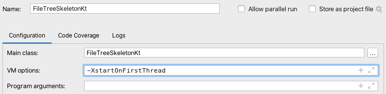

O objetivo deste exercício é desenvolver uma pequena aplicação com interface gráfica para visualizar a estrutura de dados de Ficheiros/Diretórios resultante do [exercício anterior](visitanteficheiros). Vamos utilizar a biblioteca [SWT](http://www.eclipse.org/swt) para desenvolvimento da GUI.

<video width="500" controls>
  <source src="filetree.mov" type="video/mp4">
Your browser does not support the video tag.
</video>

### Preparação

1. Descarregar o [código esqueleto](FileTreeSkeleton.kt) que exemplifica a utilização de SWT, e incluir no projeto. Não deverá compilar dada a ausência da biblioteca.

2. Descarregar o [JAR](https://download.eclipse.org/eclipse/downloads/drops4/R-4.19-202103031800/) da biblioteca (secção *SWT Binary and Source*), e incluir nas dependências do projeto.

3. Executar o *main* presente no ficheiro.

**Nota:** os utilizadores Mac terão que acrescentar uma diretiva de execução adicional (**-XstartOnFirstThread**).

### 1. Árvore
No primeiro passo, a ideia é concentrarmo-nos apenas na árvore. Deverá ser possível passar um objeto *diretório* ([exercício anterior](visitanteficheiros)) que será interpretado para desenhar a árvore.

Dicas:
1. Os nós da árvore (*TreeItem*) podem ser criados durante um processo de visita (*visitor*).
2. Os objetos *TreeItem* têm uma propriedade *parentItem* para aceder ao seu nó pai.

### 2. Interação
Após conseguirmos ter a árvore bem formada, abordamos os dois aspetos de interação presentes no vídeo.

#### Total de elementos do diretório
Ao selecionar um diretório deverá ser mostrado quando elementos estão contidos no mesmo (recursivamente).

#### Nova janela
Ao primir o botão open deverá ser aberta uma nova janela com o diretório selectionado como raiz. Note-se que o botão apenas está ativo quando selecionamos um diretório.

Dicas:
1. Os objetos gráficos têm uma propriedade alterável *isEnabled* para ativar/desativar.
2. Após alteração de um objeto gráfico (pe. o texto uma *Label*), é conveniente executar *requestLayout()* no mesmo de modo a que o mesmo seja redesenhado.
