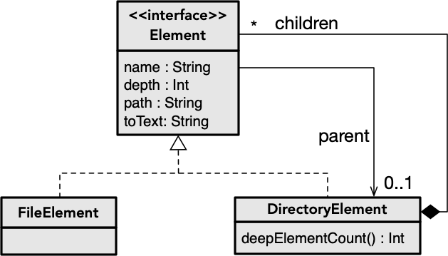

O objetivo deste exercício é aplicar o padrão de desenho [Visitante](../../padroesdesenho/visitante) (*Visitor*) de raiz atuando sobre uma estrutura simples. A estrutura será a representação dos elementos de um sistema de ficheiros (diretórios que contêm ficheiros, formando uma árvore).

**Nota:** Completar a estrutura de dados desenvolvida no exercício [File Composite](https://andre-santos-pt.github.io/kotlin/06_objetos/exercicios/filecomposite), baseada no padrão [Objetos Compostos](https://andre-santos-pt.github.io/kotlin/padroesdesenho/objetoscompostos).

### 1. Funções sobre a estrutura

Escrever funções de extensão sobre a estrutura para, e respetivos testes:

- recolher ficheiros de um diretório recursivamente.


- colecionar diretórios recursivamente que obedeçam a um critério variável (exemplos: ter alguma característica no nome ou um número de filhos mínimo).


- procurar ficheiro com um dado nome, devolvendo-o (pode não existir).


### 2. Desenvolver infraestrutura para visitantes

A solução recursiva para as funções anteriores foi provavelmente semelhante, e seria também para outras funções que tivessem que varrer a estrutura. O objetivo neste passo é desenvolver a infraestrutura que permitirá objetos visitantes possam varrer a estrutura sem que ter que saber *como* o fazer.

### 3. Desenvolver funções com visitantes

Obter implementações alternativas às funções da questão (1) com recurso a visitantes.
