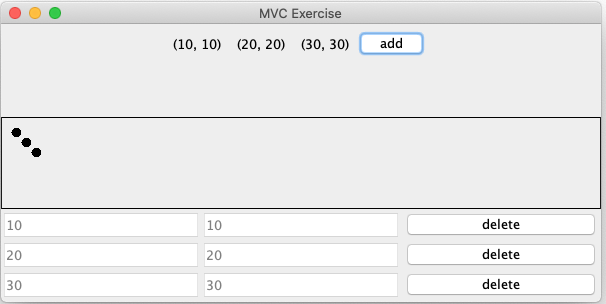
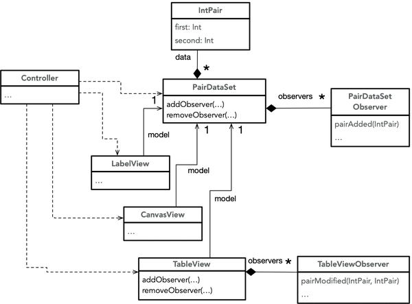

O objetivo deste exercício é tomar contacto com o padrão arquitetural *model-view-controller* (MVC), lidando com uma implementação onde tudo é feito de raiz (sem utilizar uma *framework* como base). Os dados (modelo) consistem num conjunto de pares de inteiros (sem repetições). A aplicação contém diversas vistas que atuam sobre o modelo:
- *label* simples apenas para mostrar os pares de inteiros
- *canvas* para mostrar os pares de inteiros em coordenadas bidimensionais
- tabela editável para modificar e apagar pares de inteiros

## Setup

Vamos partir de uma aplicação incompleta com algumas partes de uma arquitetura MVC, que será completada ao longo do exercício. As marcas *TODO* ajudam a localizar as partes a modificar.

1. Descarregar o código [mvc.zip](mvc.zip); contém um pacote *mvc* com várias classes.

2. Executar o *main* em *Controller*, verificando que:
  - adicionar um par via *add* provoca alterações no *canvas*, mas não no *label*
  - nenhuma das ações da tabela tem efeito: clicar nas caixas para editar ou primir *delete*

### Classes fornecidas

- Os objetos *PairDataSet* representam o modelo, e os mesmos são observáveis. Apenas a operação para adicionar está implementada.

- A classe *LabelView* representa a vista do modelo num *label*, mas ainda não reage a alterações no modelo.

- A classe *CanvasView* representa a vista do modelo no *canvas*, e reage a novos pares no modelo. Ao clicar na sua área é impresso a coordenada no ecrã, mas a ideia é que esta ação dê origem a um novo ponto no modelo.

- A classe *TableView* representa a vista do modelo na tabela, e não ainda reage a qualquer alteração no modelo, nem tão pouco as suas ações têm efeito. Contudo, com a implementação atual é possível registar observadores.

- A classe *Controller* tem apenas o *main*, instanciando o modelo e as vistas.

## Infraestrutura de MVC

### 1. LabelView com observação

Completar a classe *LabelView* por forma a que o modelo seja observado, e qualquer alteração dê origem à modificação do texto da *label*. Testar verificando que adicionar um par já surte efeito no *label*.

### 2. Canvas observável
Completar a classe *CanvasView* por forma que seja observável. Deverá ser possível que os observadores tenham acesso aos pontos onde são feitos cliques no *canvas*.

1. Fazer com que os objetos *CanvasView* possam ser observados.

2. Modificar o controlador (*main*) para reagir aos cliques adicionando novos pares ao modelo.

**Atenção:** a vista *CanvasView* não deve alterar o modelo diretamente.

### 3. Substituição observável em PairDataSet

1. Completar a classe *PairDataSet* com uma operação observável para substituir um elemento.

2. Alterar o controlador para reagir a eventos de edição de valores, alterando a tabela.

**Atenção:** a vista *TableView* não deve alterar o modelo diretamente.

### 4. Remoção de elementos

1. Completar a classe *PairDataSet* com uma operação para remover um elemento.

2. Alterar a classe *TableView* para notificar eventos de clique no botão *delete*.

3. Alterar o controlador para reagir aos eventos de *TableView*, resultando em alterações no modelo.

**Atenção:** a vista *TableView* não deve alterar o modelo diretamente.

### 5. Reação em TableView

1. Alterar a classe *TableView* por forma a reagir a alterações no modelo. Utilizar as operações já desenvolvidas na classe para acrescentar/modificar/remover linhas.

2. Testar para verificar que todos os tipos de alterações no modelo são devidamente refletidas nas vistas.

## Infraestrutura de comandos (histórico)
Tendo a arquitetura de MVC operacional resultante da secção anterior, agora o objetivo é adicionar a funcionalidade de *undo*. Estes novos desenvolvimentos implicarão algum *refactoring*, e tornarão mais evidente a importância das vistas não alterarem o modelo diretamente. Desta forma, conseguimos centralizar as operações que alteram estado no controlador e facilitar a concretização do histórico.

A funcionalidade de *undo* implica manter um histórico de comandos realizados. Este é um propósito típico para o padrão [Comandos](../comandos). Para tal, é conveniente representar os comandos da aplicação em objetos compatíveis com uma interface comum contendo duas operações: executar e anular o comando (*undo*).



O histórico de comandos pode ser guardado numa pilha:
- Quando um comando é executado, o objeto correspondente é guardado no topo da pilha.
- Ao fazer *undo*, o último comando executado é removido do topo da pilha e a operação para anular é executada.

### 6. Comandos em objetos

1. Definir uma interface para representar comandos (semelhante à apresentada acima).

2. Implementar uma classe para cada tipo de modificação ao modelo compatível com a interface.

3. *Refactoring* do código do controlador inicial que executava as alterações no modelo por forma a que utilize as novas classes. Testar se a aplicação se mantém funcional.

### 7. Pilha de histórico

1. Implementar uma estrutura de dados para pilha do histórico.

2. Alterar o código do controlador para que todas as execuções de comandos passem por (1).

3. Acrescentar um botão na interface para executar *undo* e testar.

## Extensões
Se a arquitetura MVC estiver bem conseguida, a o desenvolvimento de extensões deverá ser leve, nomeadamente ao nível de novos comandos e novas vistas. Isto faz da aplicação uma pequena *framework* -- uma aplicação base funcional que pode ser customizada com comportamento adicional.

O objetivo agora é por esta característica à prova, implementando:
1. Um novo comando para remover todos os elementos do modelo, integrando-o com um botão na interface gráfica.  

2. Uma nova vista que exibe os pares em forma de histograma. Esta vista poderá ser observável no que diz respeito a cliques nas barras (pe. aumentando/diminuindo o valor associado).
