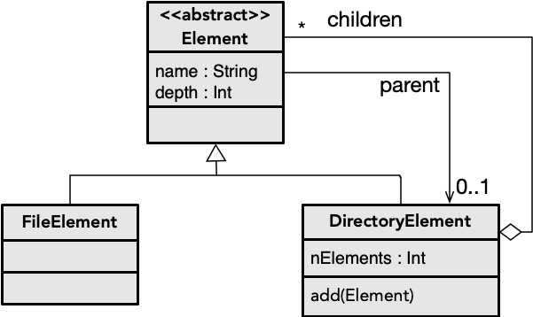

O objetivo deste exercício é aplicar o padrão de desenho Visitante (*Visitor*) de raiz atuando sobre uma estrutura simples. A estrutura será a representação dos elementos de um sistema de ficheiros (diretórios que contêm ficheiros, formando uma árvore).

**Nota:** Completar a estrutura de dados desenvolvida no exercício [File Composite](https://andre-santos-pt.github.io/kotlin/06_objetos/exercicios/filecomposite), baseada no padrão [Objetos Compostos](https://andre-santos-pt.github.io/kotlin/padroesdesenho/objetoscompostos).

### 1. Funções sobre a estrutura

Escrever funções sobre a estrutura para:
1. procurar ficheiro com um dado nome
2. contar quantos ficheiros existem com uma dada extensão
3. saber qual a profundidade da árvore de ficheiros

### 2. Desenvolver infraestrutura para visitantes

A solução recursiva para as funções anteriores foi provavelmente semelhante, e seria também para outras funções que tivessem que varrer a estrutura. O objetivo neste passo é desenvolver a infraestrutura que permitirá [Objetos Visitantes](../../padroesdesenho/visitante) possam varrer a estrutura sem que ter que saber *como* o fazer.

a) Definir uma interface para representar os tipos de elementos que podem ser visitados (ficheiros ou diretórios)

b) Definir o procedimento para aceitar visitantes (tipicamente, *accept*).

### 3. Desenvolver funções com visitantes

a) Implementar as funções da questão (1) com recurso a visitantes.

b) Implementar uma impressão da estrutura em árvore, do estilo:

 - dirA
   - f1
   - f2
   - dirB
     - f3
     - f4
   - dirC
     - f5
     - dirD
