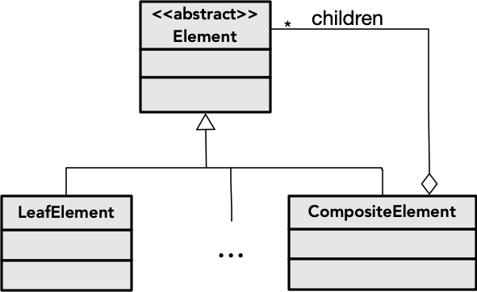

Por vezes a informação ou entidades que queremos representar num sistema são compostas por diferentes tipos de elementos relacionados que se organizam numa hierarquia (árvore). A estrutura resultante pode ser recursiva, no sentido em que elementos de um tipo podem conter elementos desse mesmo tipo.

Exemplos:
- sistema de ficheiros: diretórios contêm ficheiros e outros diretórios
- interface gráfica: painéis contêm elementos de interação (botões, caixas de texto, etc) e outros painéis
- JSON: as propriedades de um objeto podem ser de tipos distintos (inteiros, strings, etc), bem como de outros objetos

O padrão de desenho **Objetos Compostos** consiste numa forma de estruturar classes para representar hierarquias de composição de objetos. Existirá um tipo abstrato (classe abstrata ou interface) para representar os elementos como um todo, e diferentes variantes em classes concretas. Alguns objetos serão compostos, contendo outros objetos da família (pe. diretórios), ao passo que outros serão pontos terminais na hierarquia (pe. ficheiros).

