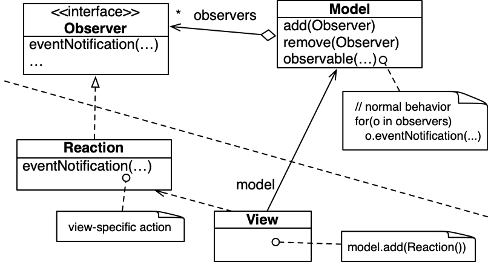

No contexto de sistemas interativos, nomeadamente os que são baseados numa arquitetura MVC (*model-view-controller*) onde vistas reagem a alterações num modelo (dados), é essencial ter uma forma de concretizar esta  reação. Acresce que é desejável ter o modelo independente das diversas possíveis vistas, e logo, a implementação deste não poderá depender das vistas. O padrão de desenho Observador (*Observer*, também conhecido por *Publish-Subscribe*) é adequado para estas situações.

- Este padrão consiste em ter uma interface cujas operações representam reações a operações observáveis. O modelo apenas depende desta interface, e mantém uma coleção de objetos compatíveis.

- Quando uma operação observável é executada, o modelo notifica os observadores através da invocação de uma operação (da interface).

- Os observadores (pe. vistas) desenvolvem implementações da interface, e registam-nas no modelo. Isto implicará que cada vez que uma operação observável é executada, o comportamento de reação definido é executado.

