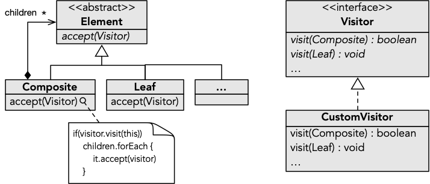

Ao passo que será simples escrever código para um varrimento pelos elementos de uma estrutura de dados linear cujos elementos têm o mesmo tipo (pe. uma lista), quando estamos perante uma estrutura de objetos hierárquica, potencialmente com diferentes tipos de objetos, a tarefa poderá não ser trivial.

O padrão de desenho **Visitante** (*Visitor*) consiste num tipo de solução para facilitar o varrimento de estruturas de dados hierárquicas. A metáfora associada é a do objeto "visitante" que consegue fazer uma visita por todos os elementos (ou parte) da estrutura, sem que tenha que entender como navegar de uns elementos para os outros. Um caso típico são estruturas recursivas (por exemplo com base em [Objetos Compostos](objetoscompostos)), onde é formada uma árvore com nós folha (terminais) e nós compostos (que contêm outros nós).

# Implementação com distinção de tipos

A primeira técnica de implementação que apresentamos é a forma clássica de implementação de infraestrutura para objetos visitantes. Por oposição à técnica de implementação seguinte, esta requer mais artefactos, mas é também a mais flexível.

## Interface dos visitantes
O elemento central quando aplicamos este padrão é uma interface que incluí uma operação para cada elemento visitável da estrutura com que estamos a trabalhar. Tipicamente, é utilizado o identificador *visit* sobreposto para os vários tipos de elementos.



O propósito da interface é permitir que objetos compatíveis (os *visitantes*) sejam utilizados no varrimento da estrutura. Ao ser visitado um nó de determinado tipo, será invocada a operação *visit* correspondente.

A interface acima consiste na forma mais elementar, porém, normalmente as operações têm uma implementação por omissão, para evitar terem que ser definidas quando a utilização não necessita de tratar alguns tipos de elementos. Por outro lado, as operações de visita a elementos compostos poderão ser booleanas, por forma a indicar se o varrimento deve prosseguir para dentro do mesmo. Desta forma é possível efetuar varrimentos parciais da estrutura. Por fim, também é frequente ter uma operação para sinalizar o fim do processamento de um elemento composto, para que possa ser tomada uma ação nesse momento caso necessário.



## Adaptação da estrutura

Uma vez tendo a interface dos visitantes, é necessário adaptar a estrutura para permitir o varrimento. Tipicamente, é utilizado o identificador *accept* ("aceitar o visitante") para a operação que desencadeia o varrimento.



O caso mais simples é o dos elementos folha, e consiste apenas em invocar a operação correspondente.



Já os elementos compostos exigem um procedimento mais elaborado. Assumindo a segunda versão da interface *Visitor*, a operação de visita é invocada, e apenas caso devolva verdadeiro se prossegue para os elementos filho, invocando *accept* em cada um. Por fim, depois do processamento dos filhos, é invocado a operação de fim de visita (*endVisit*).



## Utilização
Uma vez tendo a estrutura de dados adaptada, podemos em qualquer um dos seus elementos iniciar uma visita fornecendo o objeto visitante.



# Implementação com tipo polimórfico

Uma forma mais simples para a concretização de visitantes é a utilização de uma única função como interface de visita.



O parâmetro representa o elemento que está a ser visitado, ao passo que o retorno tem o mesmo significado que na solução clássica (indicar se a visita deve continuar). A referência ao elemento é polimórfica, sendo o seu tipo o mais abstrato da hierarquia. 

Dado que a interface apenas tem uma operação, esta pode ser representada com lambdas. Seguindo esta opção, o topo da hierarquia irá ter a seguinte operação para aceitar visitantes. 



Esta operação assume por omissão que o elemento é folha, e assim sendo, os elementos deste tipo não têm que a definir (herdam a definição acima).



Já nos tipos dos elementos compostos, a operação terá que ser definida por forma a que a visita seja propagada para os filhos.



No seguinte exemplo de utilização de visitante, é passada uma expressão lambda que conta todos elementos.



O seguinte exemplo ilustra uma função que conta os elementos de cada tipo.



