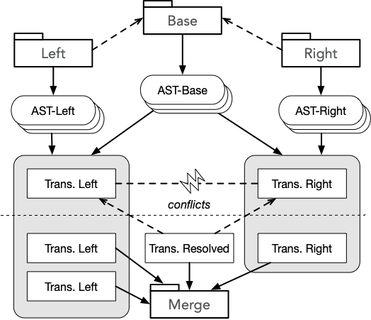
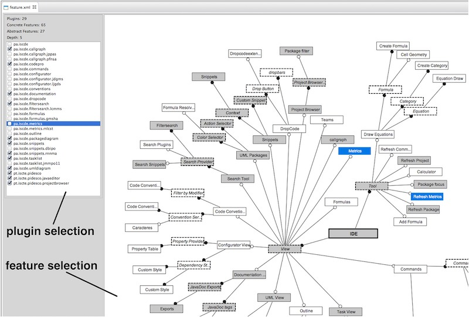

> A large amount of software development effort relates to its maintenance as systems evolve.
>
> I've worked in approaches related to software maintenance under distinct perspectives: code merging, variability management, and traceability.

*Click on <i class="fa fa-book"></i> to see related publications;  <i class="fa fa-github"></i> to visit the repository on Github.*

***

## Jaid <a href="https://github.com/adrts-iscte/Jaid"><i class="fa fa-github fa-lg"></i></a>

 An approach for code merging using transformations and member identity. The prototype implementation supporting Java uses [JavaParser](https://javaparser.org) for representing code as Abstract Syntax Trees. 

***

## Feature models to configure plugin-based systems <a href="https://github.com/andre-santos-pt/eclipse-feature-editor"><i class="fa fa-github fa-lg"></i></a>
 An approach for managing the variability offered by the plugin-based system of Eclipse ([Equinox/OGSi](https://www.eclipse.org/equinox/){:target="_blank"}) by means of feature models -- these are manipulated as a technical DSL to define valid system configurations.

 

***

## GUI-driven code tracing <a href="https://github.com/andre-santos-pt/guita"><i class="fa fa-github fa-lg"></i></a>

 GUI-driven code tracing helps to locate source code by interacting with the application.

<iframe width="420" height="315" src="https://www.youtube.com/embed/1lmRg2_RoqU?si=hXhWkLKmIbrG5LHu" frameborder="0" allowfullscreen></iframe>

***
