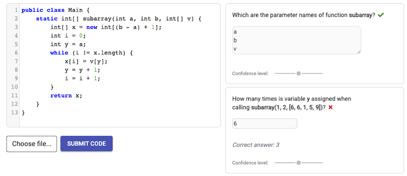

> A growing number people with different backgrounds writes programs of some sort. Programming has an inherent essential difficulty that is considered hard to learn (and teach) for many people.
>
> I was involved in the organization of catalog of programming misconceptions (see <https://progmiscon.org>{:target="_blank"}, in collaboration with the [LuCE Research Lab](https://luce.si.usi.ch){:target="_blank"}).
> 
> I have participated in a Dagstuhl Seminar on [Notional Machines and Programming Language Semantics in Education](http://www.dagstuhl.de/19281){:target="_blank"}.
>
> I served as PC member of [Koli Calling](https://www.kolicalling.fi){:target="_blank"} - International Conference on Computing Education Research, 2016-22.
> I am a member of the International Committee of the [SIGSCE Technical Symposium](https://sigcse2023.sigcse.org).
>
> I work on tools to facilitate understanding of program state (variable behaviour) and programming metaphors (object-orientation).

*Click on the icon <i class="fa fa-book"></i> to see related publications.*

***
## Jask
 A system capable of generating questions about the Java code (static and dynamic) targeting the first stages of programming learning. In collaboration with the [LeTech Research Group](https://research.cs.aalto.fi/LeTech/){:target="_blank"}.

 

***

## PandionJ

 An educational Java debugger that leverages on detecting variable roles to provide rich are meaningful visualisations of state. This work was initially developed in the MSc thesis of [Hugo Sousa](https://www.linkedin.com/in/hugo-sousa-43456928/){:target="_blank"}.

This tool also includes most of the ideas previously developed in AguiaJ. The tool is currently being used at the introductory programming courses of our institution. Downloads and more information available at: <https://pandionj.iscte-iul.pt>{:target="_blank"}

<iframe width="420" height="315" src="https://www.youtube.com/embed/pdvq6OVHpu8" frameborder="0" allowfullscreen></iframe>

***

## AguiaJ

 An educational runtime for Java (based on class reflection) that embodies metaphors of object-orientation allowing fast experimentation of objects. (website no longer available)
<iframe width="420" height="315" src="https://www.youtube.com/embed/3E2GAxCA4h8" frameborder="0" allowfullscreen></iframe>
