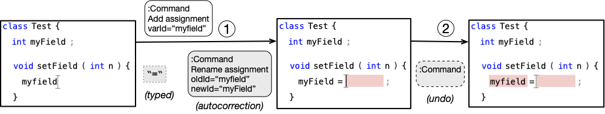
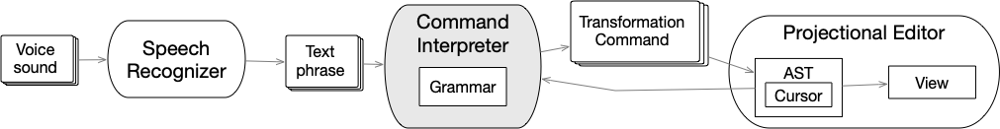

> Writing software may not necessarily involve typing characters in a text editor. [Projectional editors](https://martinfowler.com/bliki/ProjectionalEditing.html) are an alternative kind of editor where an in-memory model representation is visualized and manipulated through a dedicated editor (also referred to as [Structure(d) editor](https://en.wikipedia.org/wiki/Structure_editor)).

*Click on <i class="fa fa-book"></i> to see related publications;  <i class="fa fa-github"></i> to visit the repository on Github.*

***

## Javardise <a href="https://github.com/andre-santos-pt/javardise"><i class="fa fa-github fa-lg"></i></a>
  A projectional editor for a subset of Java, extensible with basic plugins. 

Uses [JavaParser](https://javaparser.org) as the model representation of Java code. Here's an informal talk at [Strumenta Virtual Meetup](https://www.youtube.com/watch?v=YAtE3qC6C5w) about the editor.

***

## Javardeye
 An early sketchy prototype where eye gaze is integrated with Javardise to control the cursor position, avoiding mouse movements and/or keystrokes.

<iframe width="420" height="315" src="https://www.youtube.com/embed/o0qS2GJ85xk?si=KA2dfVUvA-TJAPVt" frameborder="0" allowfullscreen></iframe>

***

## PescaJ <a href="https://github.com/Jose-f-Lopes/PescaJ"><i class="fa fa-github fa-lg"></i></a>
 A projectional editor for Java that provides views that aggregate scattered code/documentation. Built using the widgets of Javardise.

This work was developed in the MSc thesis of [José Lopes](https://www.linkedin.com/in/jose-fau-lopes/){:target="_blank"}.

<iframe width="420" height="315" src="https://www.youtube.com/embed/YLuqTLYFgqw?si=h9xUqczgpYj9owWP" frameborder="0" allowfullscreen></iframe>

***

## Autocorrection on projectional editing <a href="https://github.com/andre-santos-pt/javardise"><i class="fa fa-github fa-lg"></i></a>
  An extension to Javardise with autocorrection features.

This work was developed in the MSc thesis of [Ângelo Mendonça](https://www.linkedin.com/in/ângelo-miguel-de-lima-mendonça-1b657b1b9/){:target="_blank"}.

{: style="width: 600px; margin-right: 2em;"}

***

## Jasay
  An extension to Javardise to support coding with the voice.

This work was developed in the MSc thesis of [Alexandre Cancelinha](https://www.linkedin.com/in/alexandre-cancelinha-9849081a3/){:target="_blank"}.

{: style="width: 600px; margin-right: 2em;"}