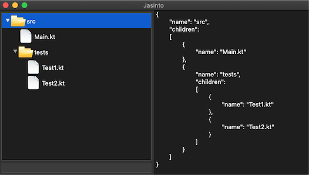
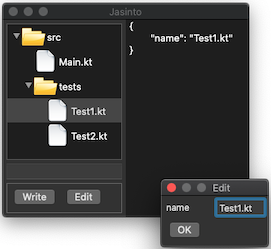

Este projeto consiste em desenvolver uma biblioteca para produzir dados no formato [JSON](http://www.json.org). Na sua forma mais simples, podemos apenas instanciar objetos da biblioteca (modelo) e serializar para texto. Será possível também derivar JSON a partir de objetos, podendo o processo ser adaptado por via de anotações nas classes desses objetos. Não será exigido o *parsing* de JSON textual.

Será assumida a perspectiva de quem está a desenvolver algo para terceiros utilizarem (biblioteca). Assim sendo, aspetos de **API (forma e documentação)** deverão ser tidos em conta. Por outro lado, a biblioteca deverá oferecer alguma flexibilidade na sua utilização para permitir aplicá-la num leque alargado de situações.

Por forma a garantir uma boa arquitetura da solução, e simultaneamente ter um "guia" para o desenvolvimento, o projeto deverá ser faseado de acordo com o que se propõe neste enunciado. A funcionalidade terá que ser feita de raiz, **não é permitida a utilização de quaisquer bibliotecas externas** (exceto as coleções e JUnit).

As funcionalidades principais deverão ter **casos de teste** correspondentes, como forma de controlar a qualidade e demonstrar a funcionalidade.

# Fase 1 - Modelo de dados

Nesta fase o objetivo é ter um conjunto de classes cujos objetos representam uma estrutura de dados JSON em memória. O JSON textual será obtido através do varrimento desta estrutura.

Não devemos gerar JSON textual diretamente, mas sim ter objetos em memória (que designaremos por *modelo*) que representam os dados. Estes por sua vez são serializados para texto (e potencialmente para ficheiros). Isto permitirá uma maior flexibilidade na manipulação dos dados (pe., fazer pesquisas e validações).

As classes do modelo deverão oferecer uma forma de varrimento baseada em *visitantes* (padrão de desenho *Visitor*). Utilizando esta forma deverá ser possível:
- serializar a estrutura para texto
- efetuar pesquisas, como por exemplo:
  - obter todas as strings
  - obter todos os objetos que têm determinadas propriedades

# Fase 2 - Inferência por reflexão

Nesta fase o objetivo é desenvolver funcionalidade que permita instanciar automaticamente o modelo (desenvolvido na Fase 1) por reflexão de quaisquer objetos de valor (*data class*).

Deverá haver uma forma padrão de instanciação que suporte:
- objetos de valor (*data class*)
- coleções (*Collection*)
- tabelas (*Map*)
- tipos primitivos
- strings
- enumerados

Como forma de adaptar a instanciação, deverão ser definidas anotações para permitir:
- excluir propriedades da instanciação
- utilizar outros identificadores

# Fase 3 - Visualizador

O objetivo aqui é desenvolver um visualizador de JSON capaz de mostrar os objetos do modelo de dados (Fase 1). O visualizador será uma pequena aplicação gráfica ao estilo do vídeo em baixo. Não tem que ter o mesmo aspeto, mas sim o mesmo tipo de funcionalidade.

<video width="500" controls>
  <source src="jasinto.mov" type="video/mp4">
Your browser does not support the video tag.
</video>

Funcionalidade requerida:
1. a janela do editor deverá ser inicializada fornecendo um objeto do modelo de dados JSON, sendo a árvore construída a partir desse.
2. ao selecionar um elemento na árvore, o JSON serializado deverá ser mostrado (tendo o elemento selecionado como raiz).
3. deverá ser possível efetuar uma pesquisa por texto, sendo que todos os elementos JSON que contenham esse texto são marcados na árvore (*highlight*).

Deve ser utilizada a biblioteca SWT (JAR) para implementar a aplicação. Os aspetos puramente estéticos não são relevantes no contexto deste projeto, pelo que o esforço deverá incidir sobre a funcionalidade e correta integração com o modelo de dados (Fase 1).

# Fase 4 - Plugins para visualizador

Após ter uma versão funcional do visualizador (Fase 3), o objetivo é permitir que o mesmo seja extendido mediante *plugins* para personalizar a visualização e acrescentar ações. A infraestrutura para concretizar os plugins deverá ser a que foi desenvolvida na [aula prática](/kotlin/metaprogramacao/exercicios/windowplugin).

**Atenção**: A inclusão/exclusão de um plugin em caso algum exigirá alterar o código base, dado que isto será feito no ficheiro de configuração.

## Apresentação

Um dos tipos de plugin permitirá personalizar a apresentação da árvore, por forma a que seja possível:
1. atribuir ícones aos nós (de acordo com um critério)
2. fornecer o texto dos nós (com base no conteúdo dos objetos)
3. excluir a criação de alguns nós

Na seguinte imagem temos o editor com um plugin que apresenta ícones distintos para ficheiros/diretórios, utiliza a propriedade *name* para o texto dos nós, e excluí a criação de nós para as propriedades.

Para este tipo de plugin apenas será suportado um tipo de visualização por configuração.

## Ações
O outro tipo de plugin diz respeito a ações que podem ser executadas pelo utilizador (botões ou menus de contexto). A ideia é ter um mecanismo que permita estender o editor base com ações que atuam sobre o modelo JSON que é mostrado na árvore. Desta forma, fará sentido que os plugins tenham um acesso fácil ao JSON, incluindo o nó que está selecionado.

Exemplos de ações:
1. Editar as propriedades de um objeto JSON.
2. Escrever o JSON visível na área da direita para um ficheiro.
3. Efetuar uma validação (pe. todos os ficheiros têm nome?)
4. Abrir uma janela que fornece uma visualização alternativa para o objeto selecionado.

Ao contrário do primeiro tipo de plugins, este permitirá vários plugins de ações em simultâneo.

# Distribuição e entrega

O projeto deverá estar no repositório indicado previamente, simulando que se trata de uma biblioteca disponível para terceiros utilizarem. Desta forma, para além do código fonte, o repositório deverá conter no Wiki também dois tutoriais sobre:
1. como utilizar o modelo de dados (Fase 1 e 2)
2. como desenvolver plugins para o visualizador (Fase 3 e 4)
